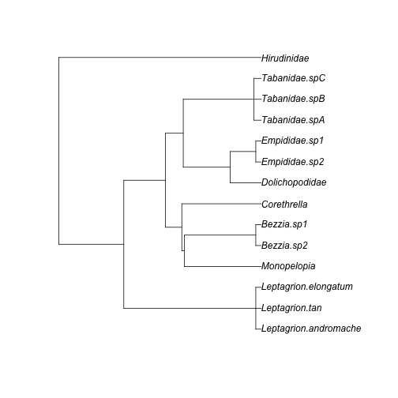
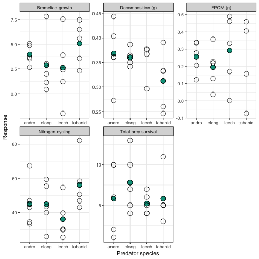
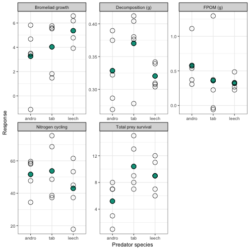

# Predator phylogeny

We used information from timetree.org to add node ages to our tree.  This web service provides age estimates from the literature for all available pairs of taxa from the same groups as the searched taxa. Thus deeper nodes are estimated from more taxa and studies than shallower nodes.  

**Table S1** Studies used to date nodes on our predator phylogeny.  When more than one study was available, we used the median value.  

\begin{table}[ht]
\centering
\begin{tabular}{llllll}
  \hline
study taxa & Reference & Taxon.A & Taxon.B & Time & Year \\ 
  \hline
Ceratopogonidae\_Chironomidae & Bertone et al.  & Ceratopogonidae  & Chironomidae  & 213 & 2008 \\ 
  CulicidaetoChironomidae & Bertone et al.  & Chaoborinae  & Chironomoidea  & 220 & 2008 \\ 
  dolicho\_tabanid & Wiegmann et al.  & Nemestrinoidea  & Pelecorhynchidae  & 216 & 2003 \\ 
  empididaeDolichopodidae & Wiegmann et al.  & Gloma  & Liancalus  & 86 & 2003 \\ 
  insects.to.leeches & Peterson et al.  & Anophelinae  & Capitellidae  & 610 & 2008 \\ 
  insects.to.leeches & Foto et al.  & Arthropoda  & Chaetopteridae  & 561 & 2005 \\ 
  insects.to.leeches & Peterson et al.  & Arthropoda  & Annelida  & 560 & 2004 \\ 
  insects.to.leeches & Otsuka et al.  & Crustacea  & Annelida  & 700 & 2003 \\ 
  insects.to.leeches & Aris-Brosou et al.  & Culicidae  & Lumbricidae  & 543 & 2002 \\ 
  odonata-Tabanidae & Peterson et al.  & Coenagrionidae  & Anophelinae  & 385 & 2008 \\ 
  odonata-Tabanidae & Regier et al.  & Hexagenia  & Forficulidae  & 151 & 2005 \\ 
  odonata-Tabanidae & Blair et al.  & Enallagma  & gambiae species complex  & 543 & 2005 \\ 
  odonata-Tabanidae & Regier et al.  & Hexagenia  & Forficulidae  & 376.5 & 2004 \\ 
  tabanidae\_culidicae\_ie\_Diptera & Bertone et al.  & Trichoceroidea  & Oestroidea  & 196 & 2008 \\ 
  tabanidae\_culidicae\_ie\_Diptera & Peterson et al.  & Anopheles  & Drosophila  & 280 & 2008 \\ 
  tabanidae\_culidicae\_ie\_Diptera & Blair et al.  & Anopheles gambiae  & Drosophila melanogaster  & 419 & 2005 \\ 
  tabanidae\_culidicae\_ie\_Diptera & Blair et al.  & Anopheles  & Drosophila  & 474 & 2005 \\ 
  tabanidae\_culidicae\_ie\_Diptera & Aris-Brosou et al.  & Aedes  & Drosophila  & 184 & 2002 \\ 
  tabanidae\_culidicae\_ie\_Diptera & Gaunt et al.  & Anopheles  & Ceratitidini  & 265.2 & 2002 \\ 
  tabanidae\_culidicae\_ie\_Diptera & Foley et al.  & Culicini  & Drosophila  & 106.2 & 1998 \\ 
   \hline
\end{tabular}
\end{table}

**Figure S1** Predator phylogeny, with dated nodes derived from data in Table 1.  When multiple time estimates were available for the same internal node, we used the median estimate.

# Phylogenetic distance and similarity in distribution and diet: nonlinear models

Both biological and statistical effects could cause a nonlinear relationship between similarity in distribution or diet and phylogenetic distance.  Biological, because the fixed compositon of the prey community limits dissimilarity between predators. Statistical, because Pianka's similarity index is bounded by 0 and 1 and therefore an OLS linear model could potentially predict impossible (i.e. $< 0$ or $> 1$) values. We fit several nonlinear equations to our data in order to describe how the amount of divergence in distribution or diet between predators changed over evolutionary time.

## Distributional similarity

**Table S2** Linear, nonlinear and constant functions fit to the relationship of diet similarity and predator phylogenetic distance.

------------------------------------------------
   model               Equation             AIC 
----------- ------------------------------ -----
bellshaped  $a \times (PD)^2 + b \times PD 20.77
                         + c$                   

 quadratic         $a \times x + b$        21.51

  linear    $\frac{c \times {e}^{(a \times 21.56
            PD)}}{(c \times {e}^{(a \times      
                  PD)} + (1 - c))}$             

exponential $b \times {e}^{(a \times PD)}$ 21.92

 constant    $peak \times {e}^{(-1 \times  21.97
                    (PD)^2 / a)}$               
------------------------------------------------

## Diet similarity

**Table S3** Proportion of predation in feeding trials. Each cell of the graph represents a predator-prey pair; note that some pairs are represented more than others (not shown).  Composition of these trials was limited by the abundance of organisms in the field.
\begin{table}[ht]
\centering
\begin{tabular}{rrrrrrrrr}
  \hline
 & L.elong & L.tan & L.andro & leech & Stibasoma sp. & Monopelopia & Tab.B & Tab.C \\ 
  \hline
Tipulid & 0.60 & 1.00 & 1.00 & 1.00 & 1.00 & 0.40 & 0.50 & 1.00 \\ 
  Culex & 0.80 & 0.57 & 1.00 & 0.17 &  & 0.00 &  &  \\ 
  Polypedilum.1 & 1.00 & 1.00 & 1.00 &  & 0.50 & 0.60 &  &  \\ 
  Scirtes.A & 0.82 & 0.75 & 0.80 & 0.67 & 0.20 &  &  &  \\ 
  Chironomus.detriticula & 1.00 & 1.00 & 1.00 &  & 0.80 &  &  &  \\ 
  Psychodid & 1.00 &  & 0.80 & 0.50 & 0.25 &  &  &  \\ 
  Hirudinidae & 0.17 & 0.00 &  & 0.00 &  &  &  &  \\ 
  Ostracoda & 0.27 & 0.62 &  &  &  & 0.00 &  &  \\ 
  Phylloicus.bromeliarum & 0.00 & 0.12 &  &  &  & 0.00 &  &  \\ 
  Polypedilum.2 & 1.00 &  & 1.00 &  & 0.80 &  &  &  \\ 
  Scirtes.B & 0.57 & 0.57 &  & 0.67 &  &  &  &  \\ 
  Monopelopia & 1.00 & 0.75 &  &  &  &  &  &  \\ 
   \hline
\end{tabular}
\end{table}

**Table S3** Linear, nonlinear and constant functions fit to the relationship of diet similarity and predator phylogenetic distance. These models are weighted by the number of prey species tested, but do not correct for the phylogenetic non-independence of the predator taxa.

-------------------------------------------------
   model               Equation             AIC  
----------- ------------------------------ ------
 quadratic         $a \times x + b$         -638 

exponential $b \times {e}^{(a \times PD)}$ -634.9

  linear    $\frac{c \times {e}^{(a \times -634.7
            PD)}}{(c \times {e}^{(a \times       
                  PD)} + (1 - c))}$              

bellshaped  $a \times (PD)^2 + b \times PD -630.5
                         + c$                    

 constant    $peak \times {e}^{(-1 \times  -625.2
                    (PD)^2 / a)}$                
-------------------------------------------------

<!--
calculates the the difference in feeding rate.
Among the most common predator taxa (i.e. those used in our experiment,
described below) the damselflies (_Leptagrion andromache_ and _Leptagrion
elongatum_) showed the highest rates of prey consumption (prey consumed in ` r andro`% and ` r elong`% of trials, respectively). 
-->

# Predator diversity experiment

## Prey community composition 

We estimated the densities of these common prey species based on their abundances in our 2008 observational dataset.  We estimated how many of each taxa would be found in a bromeliad of the same size as those we used in our experiment, and adjusted our estimates slightly to account for interannual variation in invertebrate abundance.

**Table S4** Densities of prey species used in the 2010 predator diversity experiment.

|  Species                 | density |
|:------------------------:|:-------:|
| *Chironomus detriticula* |  10     |
| *Polypedium marcondesi*  |  4      |
| *Polypedium kaingang*    |  2      |
| Psychodid sp. 1          |  1      |
| *Scyrtes* sp. A          |  5      |
| *Culex* spp.             |  4      |
| *Trentepholia* sp.       |  1      |

## Experimental responses 

We calculated means and standard error for every experimental treatment and response variable.  

**Table S5**: Means and standard errors for all response variables for each predator treatment in our manipulative experiment. n = 5 for every pair of numbers, with only two exceptions due to missing values: `elong + leech` x `growth`, and `leech` x `decomp`.
\begin{table}[ht]
\centering
\begin{tabular}{llllll}
  \hline
treatment & decomp & fine & growth & N & total.surv \\ 
  \hline
andro & 0.37 ± 0.028 & 0.26 ± 0.041 & 4 ± 0.45 & 45 ± 6.2 & 5.8 ± 1.9 \\ 
  control & 0.33 ± 0.023 & 0.38 ± 0.081 & 4.7 ± 1.2 & 53 ± 2.9 & 14 ± 2.7 \\ 
  elong & 0.36 ± 0.0077 & 0.19 ± 0.054 & 2.9 ± 1.3 & 45 ± 6 & 7.8 ± 1.7 \\ 
  elong + andro & 0.33 ± 0.024 & 0.58 ± 0.14 & 3.3 ± 1.2 & 52 ± 4.8 & 5.2 ± 1.4 \\ 
  elong + leech & 0.32 ± 0.0083 & 0.32 ± 0.044 & 5.4 ± 0.62 & 43 ± 7.5 & 9 ± 1.1 \\ 
  elong + tab & 0.37 ± 0.024 & 0.36 ± 0.25 & 4 ± 0.98 & 54 ± 7.8 & 10 ± 1.5 \\ 
  leech & 0.35 ± 0.019 & 0.29 ± 0.092 & 2.6 ± 1.6 & 36 ± 5.2 & 5.2 ± 0.58 \\ 
  tabanid & 0.31 ± 0.027 & 0.24 ± 0.12 & 5.1 ± 0.95 & 56 ± 7 & 5.8 ± 1.4 \\ 
   \hline
\end{tabular}
\end{table}

## Differences among treatments

### Number of predator species

We divided our experimental design into three separate hypothesis tests.  

1. **Predator species number:** We compared the five control replicates with the means of the four single species treatments and the means of the three two-species treatments.  This tests whether species number *per se* has an effect.   
2. **Predator species identity:** We compared the four different predator taxa to see if any of these differed in their effect on the community.  
3. **Predator phylogenetic diversity:** We contrast our two predator species treatments to see how increasing PD of the predator assemblage effects our response variables. 

Because the first and third hypotheses suggest a ranking of the independent variables (increasing species number and phylogenetic diversity) we used ordinal contrasts in the corresponding linear models.

**Table S6**: Number of predator species in each experimental treatment.
\begin{table}[ht]
\centering
\begin{tabular}{ll}
  \hline
Nspp & treatment \\ 
  \hline
none & control \\ 
  one & andro \\ 
  one & tabanid \\ 
  one & leech \\ 
  one & elong \\ 
  two & elong + andro \\ 
  two & elong + leech \\ 
  two & elong + tab \\ 
   \hline
\end{tabular}
\end{table}

**Table S7**: The effect of predator species number on all 5 response variables.  We used ordinal contrasts to investigate how an increasing number of predator species influenced the response.  Treatment order was none < one < two species. (See Table S6). For each non-control treatment, replicates were the mean of all bromeliads with the same predator treatment. Control (no predator) bromeliads were used as independent replicates.  Thus there are 5 replicates for the "none" factor level, four replicates of "one predator" and three of  "two predators". Note that we model prey survival using OLS, rather than poisson regression, because we are modeling the distribution of means.

\begingroup 
\small 
\begin{tabular}{@{\extracolsep{5pt}}lccccc} 
\\[-1.8ex]\hline 
\hline \\[-1.8ex] 
 & \multicolumn{5}{c}{\textit{Dependent variable:}} \\ 
\cline{2-6} 
\\[-1.8ex] & Decomposition (g) & FPOM (g) & Bromeliad growth & Nitrogen cycling & Total prey survival \\ 
\\[-1.8ex] & (1) & (2) & (3) & (4) & (5)\\ 
\hline \\[-1.8ex] 
 Linear & 0.007 & 0.029 & $-$0.317 & $-$2.418 & $-$4.384$^{*}$ \\ 
  & (0.020) & (0.072) & (1.015) & (3.634) & (2.228) \\ 
  & & & & & \\ 
 Quadratic & $-$0.011 & 0.127 & 0.664 & 4.638 & 4.205$^{*}$ \\ 
  & (0.020) & (0.070) & (0.993) & (3.557) & (2.181) \\ 
  & & & & & \\ 
 Constant & 0.339$^{***}$ & 0.349$^{***}$ & 4.175$^{***}$ & 49.277$^{***}$ & 9.583$^{***}$ \\ 
  & (0.011) & (0.041) & (0.580) & (2.076) & (1.273) \\ 
  & & & & & \\ 
\hline \\[-1.8ex] 
Observations & 12 & 12 & 12 & 12 & 12 \\ 
R$^{2}$ & 0.055 & 0.267 & 0.064 & 0.214 & 0.497 \\ 
Adjusted R$^{2}$ & $-$0.156 & 0.104 & $-$0.143 & 0.039 & 0.385 \\ 
Residual Std. Error (df = 9) & 0.039 & 0.139 & 1.965 & 7.037 & 4.315 \\ 
F Statistic (df = 2; 9) & 0.260 & 1.636 & 0.310 & 1.226 & 4.450$^{**}$ \\ 
\hline 
\hline \\[-1.8ex] 
\textit{Note:}  & \multicolumn{5}{r}{$^{*}$p$<$0.1; $^{**}$p$<$0.05; $^{***}$p$<$0.01} \\ 
\end{tabular} 
\endgroup 

**Table S8**: Tukey post-hoc tests for the effects of predator species number on each response variable.
\begin{table}[ht]
\centering
\begin{tabular}{llrrrr}
  \hline
response & comparison & diff & lwr & upr & p.adj \\ 
  \hline
Decomposition (g) & one-none & 0.02 & -0.05 & 0.09 & 0.76 \\ 
  Decomposition (g) & two-none & 0.01 & -0.07 & 0.09 & 0.94 \\ 
  Decomposition (g) & two-one & -0.01 & -0.09 & 0.07 & 0.95 \\ 
  FPOM (g) & one-none & -0.14 & -0.40 & 0.13 & 0.36 \\ 
  FPOM (g) & two-none & 0.04 & -0.24 & 0.32 & 0.92 \\ 
  FPOM (g) & two-one & 0.18 & -0.12 & 0.47 & 0.27 \\ 
  Bromeliad growth & one-none & -1.04 & -4.72 & 2.64 & 0.72 \\ 
  Bromeliad growth & two-none & -0.45 & -4.46 & 3.56 & 0.95 \\ 
  Bromeliad growth & two-one & 0.59 & -3.60 & 4.78 & 0.92 \\ 
  Nitrogen cycling & one-none & -7.39 & -20.57 & 5.79 & 0.31 \\ 
  Nitrogen cycling & two-none & -3.42 & -17.77 & 10.93 & 0.79 \\ 
  Nitrogen cycling & two-one & 3.97 & -11.04 & 18.98 & 0.75 \\ 
  Total prey survival & one-none & -8.25 & -16.33 & -0.17 & 0.05 \\ 
  Total prey survival & two-none & -6.20 & -15.00 & 2.60 & 0.18 \\ 
  Total prey survival & two-one & 2.05 & -7.15 & 11.25 & 0.81 \\ 
   \hline
\end{tabular}
\end{table}

**Figure S2**: The effect of predator species number on each of our response variables.  Each dot represents the mean (n = 5) for different predator treatments.  Green dots represent group (i.e. species number) means.  

\pagebreak

## Differences among predator species

Within the single-predator treatments, we tested for difference in our response variables among different predator species. 

**Table S9** : Contrasting predator species effects. These linear models use treatment contrasts, which contrast all treatments with *L. andromache*.  Coefficents (standard error) are given for *L. andromache*, and differences between coefficients (standard error of difference) for all other predators.

\begingroup 
\small 
\begin{tabular}{@{\extracolsep{5pt}}lccccc} 
\\[-1.8ex]\hline 
\hline \\[-1.8ex] 
 & \multicolumn{5}{c}{\textit{Dependent variable:}} \\ 
\cline{2-6} 
\\[-1.8ex] & Total prey survival & FPOM (g) & Decomposition (g) & Bromeliad growth & Nitrogen cycling \\ 
\\[-1.8ex] & (1) & (2) & (3) & (4) & (5)\\ 
\hline \\[-1.8ex] 
 \textit{L. elongatum} & 2.000 & $-$0.062 & $-$0.008 & $-$1.080 & $-$0.220 \\ 
  & (2.069) & (0.109) & (0.031) & (1.622) & (8.656) \\ 
  & & & & & \\ 
 Hirudinidae & $-$0.600 & 0.035 & $-$0.014 & $-$1.344 & $-$9.080 \\ 
  & (2.069) & (0.109) & (0.033) & (1.622) & (8.656) \\ 
  & & & & & \\ 
 Tabanidae & $-$0.000 & $-$0.019 & $-$0.056$^{*}$ & 1.116 & 11.180 \\ 
  & (2.069) & (0.115) & (0.031) & (1.622) & (8.656) \\ 
  & & & & & \\ 
 \textit{L. andromache} & 5.800$^{***}$ & 0.256$^{***}$ & 0.368$^{***}$ & 3.960$^{***}$ & 45.020$^{***}$ \\ 
  & (1.463) & (0.077) & (0.022) & (1.147) & (6.121) \\ 
  & & & & & \\ 
\hline \\[-1.8ex] 
Observations & 20 & 19 & 19 & 20 & 20 \\ 
R$^{2}$ & 0.102 & 0.052 & 0.205 & 0.153 & 0.256 \\ 
Adjusted R$^{2}$ & $-$0.067 & $-$0.137 & 0.046 & $-$0.006 & 0.117 \\ 
Residual Std. Error & 3.271 (df = 16) & 0.172 (df = 15) & 0.049 (df = 15) & 2.564 (df = 16) & 13.686 (df = 16) \\ 
F Statistic & 0.603 (df = 3; 16) & 0.277 (df = 3; 15) & 1.289 (df = 3; 15) & 0.961 (df = 3; 16) & 1.838 (df = 3; 16) \\ 
\hline 
\hline \\[-1.8ex] 
\textit{Note:}  & \multicolumn{5}{r}{$^{*}$p$<$0.1; $^{**}$p$<$0.05; $^{***}$p$<$0.01} \\ 
\end{tabular} 
\endgroup 

**Table S10**: Post-hoc Tukey tests for differences between predator species in all 5 responses. 
\begin{table}[ht]
\centering
\begin{tabular}{llrrrr}
  \hline
response & comparison & diff & lwr & upr & p.adj \\ 
  \hline
FPOM (g) & elong-andro & -0.06 & -0.37 & 0.25 & 0.94 \\ 
  FPOM (g) & leech-andro & 0.04 & -0.28 & 0.35 & 0.99 \\ 
  FPOM (g) & tabanid-andro & -0.02 & -0.35 & 0.31 & 1.00 \\ 
  FPOM (g) & leech-elong & 0.10 & -0.22 & 0.41 & 0.81 \\ 
  FPOM (g) & tabanid-elong & 0.04 & -0.29 & 0.37 & 0.98 \\ 
  FPOM (g) & tabanid-leech & -0.05 & -0.39 & 0.28 & 0.96 \\ 
  Decomposition (g) & elong-andro & -0.01 & -0.10 & 0.08 & 0.99 \\ 
  Decomposition (g) & leech-andro & -0.01 & -0.11 & 0.08 & 0.97 \\ 
  Decomposition (g) & tabanid-andro & -0.06 & -0.15 & 0.03 & 0.31 \\ 
  Decomposition (g) & leech-elong & -0.01 & -0.10 & 0.09 & 1.00 \\ 
  Decomposition (g) & tabanid-elong & -0.05 & -0.14 & 0.04 & 0.44 \\ 
  Decomposition (g) & tabanid-leech & -0.04 & -0.14 & 0.05 & 0.60 \\ 
  Bromeliad growth & elong-andro & -1.08 & -5.72 & 3.56 & 0.91 \\ 
  Bromeliad growth & leech-andro & -1.34 & -5.98 & 3.30 & 0.84 \\ 
  Bromeliad growth & tabanid-andro & 1.12 & -3.52 & 5.76 & 0.90 \\ 
  Bromeliad growth & leech-elong & -0.26 & -4.90 & 4.38 & 1.00 \\ 
  Bromeliad growth & tabanid-elong & 2.20 & -2.44 & 6.84 & 0.54 \\ 
  Bromeliad growth & tabanid-leech & 2.46 & -2.18 & 7.10 & 0.45 \\ 
  Nitrogen cycling & elong-andro & -0.22 & -24.98 & 24.54 & 1.00 \\ 
  Nitrogen cycling & leech-andro & -9.08 & -33.84 & 15.68 & 0.72 \\ 
  Nitrogen cycling & tabanid-andro & 11.18 & -13.58 & 35.94 & 0.58 \\ 
  Nitrogen cycling & leech-elong & -8.86 & -33.62 & 15.90 & 0.74 \\ 
  Nitrogen cycling & tabanid-elong & 11.40 & -13.36 & 36.16 & 0.57 \\ 
  Nitrogen cycling & tabanid-leech & 20.26 & -4.50 & 45.02 & 0.13 \\ 
   \hline
\end{tabular}
\end{table}

**Figure S3**: The effect of predator species identity on each of our response variables.  Each dot represents the observed value for a different predator treatment.  Green dots represent group means.  

\pagebreak

## Increasing predator phylogenetic diversity

Our two-species combinations represent a range of increasing phylogenetic distance.  By examining differences between these three treatments, we can test how increasing PD *per se* influences our response variables.

**Table S11**: Effects of increasing phylogenetic diversity of the predator assemblage on 5 response variables.  We used linear contrasts, ranking the independent variable by increasing predator PD (see Figure S4).  Linear model coefficients (standard error) are shown for Linear, Quadratic and Constant contrasts.

\begingroup 
\small 
\begin{tabular}{@{\extracolsep{5pt}}lccccc} 
\\[-1.8ex]\hline 
\hline \\[-1.8ex] 
 & \multicolumn{5}{c}{\textit{Dependent variable:}} \\ 
\cline{2-6} 
\\[-1.8ex] & Decomposition (g) & FPOM (g) & Bromeliad growth & Nitrogen cycling & Total prey survival \\ 
\\[-1.8ex] & (1) & (2) & (3) & (4) & (5)\\ 
\hline \\[-1.8ex] 
 treatment.L & $-$0.006 & $-$0.179 & 1.486 & $-$6.138 & 2.687$^{*}$ \\ 
  & (0.020) & (0.167) & (1.027) & (6.841) & (1.354) \\ 
  & & & & & \\ 
 treatment.Q & $-$0.037$^{*}$ & 0.075 & 0.227 & $-$5.242 & $-$2.694$^{*}$ \\ 
  & (0.020) & (0.167) & (0.988) & (6.841) & (1.354) \\ 
  & & & & & \\ 
 Constant & 0.340$^{***}$ & 0.421$^{***}$ & 4.222$^{***}$ & 49.460$^{***}$ & 8.200$^{***}$ \\ 
  & (0.012) & (0.096) & (0.582) & (3.950) & (0.782) \\ 
  & & & & & \\ 
\hline \\[-1.8ex] 
Observations & 15 & 15 & 14 & 15 & 15 \\ 
R$^{2}$ & 0.229 & 0.102 & 0.161 & 0.104 & 0.397 \\ 
Adjusted R$^{2}$ & 0.101 & $-$0.048 & 0.009 & $-$0.045 & 0.296 \\ 
Residual Std. Error & 0.045 (df = 12) & 0.372 (df = 12) & 2.164 (df = 11) & 15.297 (df = 12) & 3.028 (df = 12) \\ 
F Statistic & 1.787 (df = 2; 12) & 0.681 (df = 2; 12) & 1.056 (df = 2; 11) & 0.696 (df = 2; 12) & 3.949$^{**}$ (df = 2; 12) \\ 
\hline 
\hline \\[-1.8ex] 
\textit{Note:}  & \multicolumn{5}{r}{$^{*}$p$<$0.1; $^{**}$p$<$0.05; $^{***}$p$<$0.01} \\ 
\end{tabular} 
\endgroup 

**Table S12**: Tukey post-hoc tests for differences between predator phylogenetic diversity treatments on all response variables.
\begin{table}[ht]
\centering
\begin{tabular}{llrrrr}
  \hline
response & comparison & diff & lwr & upr & p.adj \\ 
  \hline
Decomposition (g) & elong + tab-elong + andro & 0.04 & -0.03 & 0.12 & 0.34 \\ 
  Decomposition (g) & elong + leech-elong + andro & -0.01 & -0.08 & 0.07 & 0.96 \\ 
  Decomposition (g) & elong + leech-elong + tab & -0.05 & -0.13 & 0.03 & 0.22 \\ 
  FPOM (g) & elong + tab-elong + andro & -0.22 & -0.85 & 0.41 & 0.63 \\ 
  FPOM (g) & elong + leech-elong + andro & -0.25 & -0.88 & 0.37 & 0.55 \\ 
  FPOM (g) & elong + leech-elong + tab & -0.03 & -0.66 & 0.59 & 0.99 \\ 
  Bromeliad growth & elong + tab-elong + andro & 0.77 & -2.92 & 4.47 & 0.84 \\ 
  Bromeliad growth & elong + leech-elong + andro & 2.10 & -1.82 & 6.02 & 0.35 \\ 
  Bromeliad growth & elong + leech-elong + tab & 1.33 & -2.59 & 5.25 & 0.64 \\ 
  Nitrogen cycling & elong + tab-elong + andro & 2.08 & -23.73 & 27.89 & 0.97 \\ 
  Nitrogen cycling & elong + leech-elong + andro & -8.68 & -34.49 & 17.13 & 0.65 \\ 
  Nitrogen cycling & elong + leech-elong + tab & -10.76 & -36.57 & 15.05 & 0.53 \\ 
  Total prey survival & elong + tab-elong + andro & 5.20 & 0.09 & 10.31 & 0.05 \\ 
  Total prey survival & elong + leech-elong + andro & 3.80 & -1.31 & 8.91 & 0.16 \\ 
  Total prey survival & elong + leech-elong + tab & -1.40 & -6.51 & 3.71 & 0.75 \\ 
   \hline
\end{tabular}
\end{table}

**Figure S4**: The effect of increasing phylogenetic signal on each of our response variables in our community experiment.  In each treatment category, *Leptagrion elongatum* is paired with another predator; these treatments are ordered by increasing phylogenetic diversity.  For clarity the axes are labelled with abbreviations for species names: andro = *Leptagrion andromache*, tab = Tabanidae, leech = Hirudinidae.

## Correlation matrix

**Table S13**: Correlation matrix of all variables in our experiment. n = 30 for most of these values. Bold type indicates values of Pearson's product moment correlation with p < 0.05.

\begin{table}[ht]
\centering
\begin{tabular}{llllll}
  \hline
  & decomp & fine & growth & N & total.surv \\ 
  \hline
decomp & \textbf{} & 0.08 & \textbf{-0.33} & 0.13 & 0.15 \\ 
  fine & 0.08 & \textbf{} & 0.02 & -0.12 & -0.09 \\ 
  growth & \textbf{-0.33} & 0.02 & \textbf{} & 0.1 & 0.11 \\ 
  N & 0.13 & -0.12 & 0.1 & \textbf{} & 0.2 \\ 
  total.surv & 0.15 & -0.09 & 0.11 & 0.2 & \textbf{} \\ 
   \hline
\end{tabular}
\end{table}

