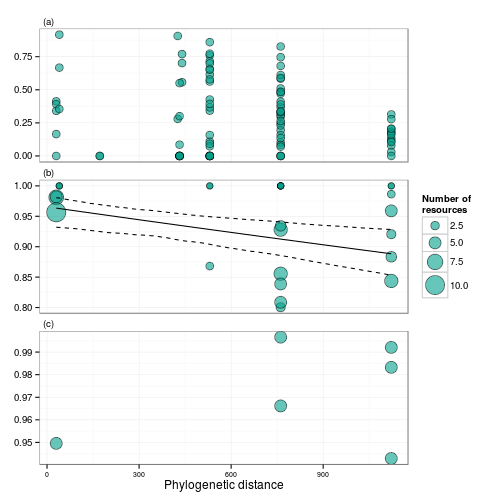
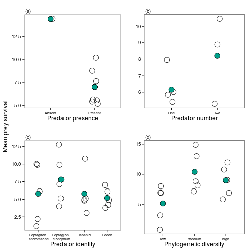
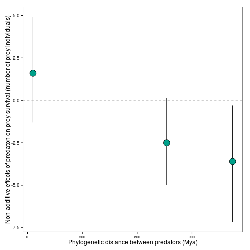

```{r options_packages_data, message=FALSE, echo=FALSE}
## set chunk options
knitr::opts_chunk$set(message=FALSE,warning=FALSE,echo=FALSE)

```

## Introduction

Predators can have strong top-down effects, both on community structure and
ecosystem processes [@Estes2011]; however the combined effects of different predator species are not
well understood. The combined effect of predators on communities is often stronger or weaker than what might be predicted from a study of those same species in isolation [@Sih1998a;@Ives2005]. These non-additive effects of predators occur when predators interact directly with each other, or indirectly
via prey species. For example, predators can feed directly on each
other (intra-guild predation), consume the same prey (resource competition) or
modify the behaviour of other predator species or prey [@Sih1998a;@Griswold2006;@Nystrom2001]. These non-additive effects can be positive or negative. For example, prey may have an induced defense against one predator which increases (negative non-additive effect) or decreases (positive non-additive effect) the likelihood of consumption by a second predator. While there are many possible mechanisms underlying the effect of predator composition, we lack a means of
predicting _a priori_ the strength and direction of predator diversity on community structure and ecosystem function.

Predator phylogenetic diversity could predict the effect of predator combinations on ecological communities. Phylogenetic diversity includes the evolutionary relationships of species into measures of diversity. Ecologists measure phylogenetic diversity in observational studies to make inferences about ecological and
evolutionary mechanisms behind observed patterns in natural communities
[@Cavender-Bares2009]. Recently, this approach has been applied to manipulative experiments. For example, the phylogenetic diversity of plant
communities is a better predictor of productivity than either species
richness or diversity [e.g. @Cadotte2009;@Cadotte2008;@Godoy2014]. A central
assumption of this approach is that increased phylogenetic distance is associated with
increased ecological dissimilarity -- either in the form of differences in
species niches, interactions, or functional traits. When this is true, high
phylogenetic diversity should lead to to complementarity in resource use between species, resulting in increased
ecosystem functioning [@Srivastava2012c]. Despite the prevalence of phylogenetic
community ecology and the importance of predators to natural systems, the
phylogenetic diversity of local predator assemblages has rarely been measured
[@Bersier2008;@Naisbit2011]. Many studies of phylogeny and predator
traits focus on whole clades, rather than local assemblages (e.g. *Anolis*
lizards [@Knouft2006], warblers [@Bohning- Gaese2003], tree boas
[@Henderson2013] and wasps [@Udriene2005]) making it difficult to connect these
results to predator effects at the scale of a local community. These 
clade specific studies often find weak evidence for phylogenetic signal in
ecologically relevant traits. In contrast, studies at the level of the whole biosphere
[@Gomez2010;@Bersier2008] demonstrate that related organisms often have similar
interspecific interactions, i.e. related predators often consume similar prey. At the local scale, only a few studes have examined how phylogeny may shape food webs (**Rezende et al 2009, Cagnolo et al**)

Within a local community, the effect of predator species diversity will depend on three factors: how predators are distributed among habitats, how they interact with prey, and how they interact with each other. To the extent that phylogenetic relationships are correlated with all of these factors, phylogeny may be able to predict the impact of predator diversity on communities. For instance, phylogeny could constrain predator species co-occurrence if more distant phylogenetic 
relatives have more distinct fundamental niches, while close relatives are too
similar to co-exist [@Webb2002;@Emerson2008]. When predators do co-occur, phylogeny may correlate with their feeding behavior, such that closely related predators consume similar prey. For example, diet overlap (shared prey species between predators) will depend on the feeding traits and nutritional 
requirements of predators -- both of which may be phylogenetically conserved. If this is the case, then predator assemblages with higher
phylogenetic diversity will show greater prey consumption and therefore stronger top-
down effects [@Finke2008a]. In some cases, predator
diets may extend to include other predators, leading to direct negative
interactions such as intraguild predation, which may also have a phylogenetic
signal [@Pfennig2000]. 

We examined the consequences of phylogenetic diversity using a natural mesocosm:
the community of macroinvertebrates living within bromeliads. Bromeliads
(Bromeliaceae) are flowering plants native to the Neotropics. Many bromeliad
species contain water and trapped, terrestrial detritus; the decomposition of
this detritus supplies nutrients for the bromeliad [@Reich2003]. The small size
of these habitats permits direct manipulations of entire food webs,
manipulations which would be difficult in most natural systems.  Within this
aquatic food web, damselfly larvae (e.g. *Leptagrion* spp.,
Odonata:Coenagrionidae) are important predators, dramatically reducing insect
colonization **Hammill et al Ecosystems** and reducing insect emergence [@Starzomski2010] and increases
nutrient cycling [@Ngai2006]). However, other predators are also found in
bromeliads, including large predaceous fly larvae (Diptera: Tabanidae) and
predatory leeches (**Frank and Lounibos**). Predators have been shown to have large top0down effects on ecosystem functions in bromelaids, including nitrogen uptake by the plant (**ngai and Srivastava**), detrital decomposition (**Srivastava oecologia, srivastava and Bell**) and CO~2~ flux (**Atwood et al nature Geosci, Atwood et al Oecologia**).

We used a series of observations, lab feeding trials, and manipulative field
experiments to measure how the phylogenetic diversity of the predator
assemblage predicts community composition and ecosystem function.  We test
three related hypotheses concerning similarity in distribution, diet and top-
down ecosystem effects of predators:

1. *Distributional similarity*: closely-related predators may occur together more
frequently than less-related predators if there is a strong phylogenetic
signal to habitat requirements. Alternatively, very closely related species
may never co-occur because high overlap in ecological niches results in
competitive exclusion.

2. *Diet similarity*: similarity in diet (as measured by feeding trials)
decreases with phylogenetic distance if diet is conserved.
Alternatively,  closely related species may have evolved different diets to
allow coexistence.

3. *Ecosystem-level effects*: our experiments at the scale at which organisms
interact (i.e. within a single bromeliad) allow us to test hypotheses about
direct and indirect effects of predator combinations (on prey consumption and
associated ecosystem functions (bromeliad nitrogen uptake and detrital
decomposition):

    (a) Closely-related predators will have similar effects on the community. This will occur if related predators have similar trophic interactions (e.g. predation rate, diet similarity). Our single-species treatments allow us to assess the effect of each predator both on prey survival and on ecosystem function (Nitrogen uptake and decomposition). 
    (b) Predator assemblages with higher phylogenetic diversity will have synergistic (greater than additive) effects on prey consumption and associated ecosystem functions. This will occur if phylogenetic distance correlates with increasing trait difference, and if this trait difference in turn results in niche complementarity. However, at the extreme, different predators may consume each other, thus creating antagonistic (less than additive) effects on prey consumption. By comparing treatments with pairs of predators to treatments that received each predator alone, we are able to estimate additive and non-additive effects. 

## Methods

### Study Design

We collected three datasets to address each of the questions posed in the Introduction. We examined distributional similarity among predator species (Question 1) by making observations of predator distribution among habitat patches. We examined diet similarity (Question 2) with a series of no-choice feeding trials in under laboratory conditions. Finally, we examined the effects of predators on whole communities (Question 3) with a field experiment, in which predators were added to habitat patches containing standardized communities of prey. This experiment included both single species treatments and two species treatments; the latter were chosen to create the widest possible range of phylogenetic diversity. 

In each dataset, we related the results to published phylogenies accessed from
"timetree.org", an online database of published  molecular time estimates
[@Hedges2006]. Node age data was available for all but the youngest nodes,
where either a lack of taxonomic information (e.g. Tabanidae) or a lack of
phylogenetic study (e.g. _Leptagrion_) prevented more information from being
included.   These branches were left unresolved and were all assigned
identical, arbitrary and short branch lengths (15 Mya).

We conducted all three experiments in Parque Estadual da Ilha do Cardoso (25^o^
03' S, 47^o^ 53' W), a 22.5 ha island off the south coast of São Paulo state,
Brazil. We worked in a coastal forest (_restinga_) with an understory dominated
by  _Quesnelia arvensis_ Mez. (Bromeliaceae). _Q. arvensis_ is a large
terrestrial bromeliad that catches and holds rainwater (phytotelmata),
accumulating up to 2.8 L of rainwater in a single plant. Our observational
survey found more than 47 species of macroinvertebrates in these aquatic
communities [@Romero2010], in `r ncol(metabolic) -1` bromeliads of various sizes.
This diversity encompasses multiple trophic and functional groups. Filter
feeders were entirely mosquito larvae (Diptera:Culicidae); detritivores include shredders
(Diptera:Tipulidae, Trichoptera:Calamoceratidae), scrapers
(Coleoptera:Scirtidae), and collectors (All Diptera:Chironomidae, Syrphidae,
Psychodidae). All these species are prey for a  diverse predator assemblage
dominated by at least three species of damselfly larvae (_Leptagrion_ spp.,
Odonata:Coenagrionidae), two species of Horse Fly larvae
(Diptera:Tabanidae), and two species of leech (Arhynchobdellida). A lower percentage of predator biomass was composed of Dytiscid larvae (Coleoptera), midge larvae (Diptera: Ceratopogonidae) and chironomid larvae (Diptera: Tanypodinae).

## Data collection

### Question 1: Distributional similarity

To examine distributional similarity among predator species, we used a
detailed survey of bromeliad communities. In 2008, each bromeliad was dissected
and washed to remove invertebrates and the resulting water was filtered
through two sieves (250 and 850 µm), which removed particulate organic matter
without losing any invertebrates. All invertebrates were counted and
identified to the lowest taxonomic level possible. The body length of all
individuals was measured when possible for small and medium-sized taxa (< 1cm
final instar) and always for large-bodied taxa (> 1 cm final instar).

### Question 2: Diet Similarity
```{r CALC_feeding_trials}
## numbers for text
ntrials <- sum(feeding_trials$number.trials)
npred <- length(unique(feeding_trials$predator.names))
nprey <- length(unique(feeding_trials$Prey.species))
ncombos <- nrow(feeding_trials)
rep_range <- range(feeding_trials$number.trials)
```

To examine diet similarity among predator species, we fed prey species to predators in laboratory feeding trials. We conducted `r ntrials` feeding trials of `r npred` predator taxa and `r nprey` prey taxa between March and April 2011.  We  included all potential predator-prey pairs present in the experiment
(described below), and attempted to perform all other combinations whenever possible. However, due to the rarity of some taxa, many predator-prey pairs were not possible; we tested `r ncombos` pairwise combinations.  Most trials were replicated at least five times, but the number of replicates ranged from `r rep_range[[1]]` to `r rep_range[[2]]`. To conduct the trials, we placed
predators together with prey in a 50ml vial, with a stick for
substrate. The only exception was the tabanid larvae, which we
placed between two vertical surfaces to imitate the narrow space found in
bromeliad leaf axils (their preferred microhabitat, necessary for successful feeding).  Generally our trials contained a single predator and a
single prey individual, except in the case of very small prey (_Elpidium_ sp.)
or predators (_Monopelopia_ sp.) in which case we increased the density.  We recorded whether prey was consumed after 24 hours.

### Question 3: Community effect experiment

Our third question had two parts: (a) how do predator species differ in their
effects on the whole community and (b) do predator combinations show non-
additive effects on the community, and do these non-additive effects increase or
decrease with phylogenetic distance? We measured five community and ecosystem
response variables: production of fine particulate organic matter (FPOM),
decomposition of coarse detritus, bromeliad growth, uptake of detrital nitrogen
into bromeliad tissue, and survival of invertebrate prey (emerged adults +
surviving larvae)

#### Experimental design

In this experiment we focused on the four most abundant large predators found in
the community: _Leptagrion andromache_ and _Leptagrion elongatum_ (Odonata:
Coenagrionidae), a predatory Tabanid fly (Diptera:Tabanidae:_Stibasoma_ sp.) and
a predatory leech. We combined these species in eight treatments: predator-free
control (no predators), each of the four predator species alone (part a) and
pairs of predator species chosen to maximize the range of phylogenetic distance
(part b). Specifically, these pairs were: two congeneric damselflies
(*Leptagrion andromache* and *Leptagrion elongatum*), two insects (*L.
elongatum* and a Tabanid predatory fly), and two invertebrates (*L. elongatum*
and a predatory leech).  We used five replicate bromeliads for each of these 8
treatments (8 treatments, n=5). This experiment, therefore, allows the estimation
of the effect of each predator species (single-species treatments), as well as the
detection of non-additive effects in predator combinations.


To evaluate the effect of these predators on natural bromeliad systems, we created bromeliad communities that were as similar as possible to each other, and also the the average composition of a bromeliad. In Feburary 2011 we collected bromeliads with a volume between 90 and 200ml,
thoroughly washed them to remove organisms and detritus, and soaked them for 12 hours in a
tub of water. We then hung all bromeliads for 48 hours to dry. This procedure was indended to remove all existing insects; one bromeliad dissected
afterwards contained no insects. We simulated natural detritus inputs from the canopy by adding a standard mass of dried leaves of the species _Plinia cauliflora_ (`r round(mean(pd_no_out$mass.g.), 2)`g bromeliad ^-1^ ± `r round(sd(pd_no_out$mass.g.), 2)`, mean ± sd). In order to
track the effects of detrital decomposition on bromeliad N cycling, we enriched
these leaves with ^15^N by fertilizing five *Plinia cauliflora* (Jabuticaba, Myrtaceae; a common Brazilian tree) 
plants with 40ml pot^-1^ day^-1^ of 5g L^-1^ ammonium sulphate containing 10%
atom excess of ^15^N. After 21 days we then collected *P. cauliflora* leaves,
air-dried until constant weight, and then soaked them for three days discarded. This procedure removes excess nutrients from the artificial fertilization. Because some of our prey species consume fine detritus, not coarse, we also added a standard amount of dried fine detritus to our bromeliads (`r round(mean(pd_no_out$org_fine_mass, na.rm = TRUE), 2)`g bromeliad ^-1^ ± `r round(sd(pd_no_out$org_fine_mass, na.rm = TRUE), 2)`) 

Each bromeliad was stocked with a representative insect community. The densities
of each prey taxon were calculated from the 2008 observational dataset, using
data from bromeliads of similar size to those in our experiment.  All densities
used were within the range of these calculated abundances, and all experimental
bromeliads received the same insect community.  Halfway through the experiment,
insects were added to bromeliads a second time to simulate the continuous
oviposition that characterizes the system.  Throughout the experiment, all bromeliads were enclosed
with a mesh cage topped with a malaise trap an?d checked daily for emergence of
adults. At the end of the experiment we completely dissected our bromeliads, collecting all invertebrates and detritus remaining inside.

We used a substitutive design which maintained the same predator
metabolic capacity in all replicates (see below). Substitutive experiments often
hold total abundance constant, but when species differ substantially in body
size - as in this experiment - allometric effects of body size on feeding rate
can confound detection of effects based on trophic traits or species
interactions, and standardizing to community metabolic capacity is preferred
[@Srivastava2009a]. Integrating the allometric relationship between body size and feeding
rate [@Brown2004; @Wilby2005] over all individuals of a species allows estimates
of "metabolic capacity", or the potential energy requirements of a species
[@Srivastava2009a]. Metabolic capacity is equal to individual body
mass raised to the power of 0.69 (an invertebrate-specific exponent determined by Peters 19xx for invertebrates and confirmed by Chown et al, [-@Chown2007]); this reflects the nonlinearity of feeding rate
on body size across many invertebrate taxa. 

To quantify the effect of predators on ecosystem function, we measured five community and ecosystem response variables: production of fine
particulate organic matter (FPOM), decomposition of coarse detritus, bromeliad
growth, uptake of detrital nitrogen into bromeliad tissue, and survival of invertebrate prey (emerged adults +
surviving larvae). At the end of the experiment, we measured the decrease in coarse detritus, and the increase in fine, by separating the collected detritus on a sieve and air drying it to constant weight before weighing. We measured uptake of labelled detrital nitrogen by analysing three innermost (closest to meristem) bromeliad leaves. Finally, we quantified the species composition and survivorship of invertebrate prey by adding together counts of emerging adult insects with counts of surviving larvae.

## Data analysis

We quantified the effect of phylogenetic distance on each of distributional (Question 1) and diet (Question 2) similarity.  First, we calculated phylogenetic distance between each pair of species, then fit several functions to the relationship between phylogenetic diversity an either distributional or diet similarity. We used linear, constant, and several appropriate nonlinear functions (nonlinear, because our measures of similarity are bounded by 0 and 1; see below). We compared these models using AIC and generated confidence intervals as appropriate (parametric or bootstrap for linear and nonlinear, respectively). We evaluated both distributional and diet similarity between predators using Pianka's index of niche overlap [@Pianka1974]:

$O_{kl}=\dfrac{\sum_i^n{p_{il} p_{ik}}}{\sqrt{\sum_i^n{p_{il}^2} \sum_i^n{p_{ik}^2}}}$

For each pair of predators, $p_{ik}$ and $p_{il}$ represent the preference of
predator $k$ or $l$ for resource or habitat $i$. The value $O_{kl}$ represents similarity (in our case, in either distribution or diet) and ranges from 0 (complete dissimilarity) to 1 (complete similarity). The $n$ resources represent the different habitats surveyed for Question 1 (distributional similarity), or the different prey species assayed for Question 2 (diet similarity). Preference ($p_{ik}$) represents the proportion of a predator's total metabolic capacity found in a particular bromeliad (Question 1); or the 
proportion of feeding trials in which it ate a particular prey (Question 2).

### Question 3: similarity in community effect

We tested effects of both single or multiple predator species on community responses with a manipulative experiment where identical communities were exposed to treatments of either a single predator, or pairs of predators representing increasing phylogenetic diversity. We divided the analysis of this experiment into three parts: quantifying the effect of phylogenetic distance on prey community similarity; community responses; and non-additive effect. First, we compared the four treatments with single predator species by calculating the similarity in species composition (Pianka's index) between surviving prey communities and relating this to the phylogenetic distance between predators. If predator feeding choices are phylogenetically conserved, that diet similarity will decline with increasing phylogenetic distance.

Second, we examined how predators affected the five community and ecosystem responses we described above, testing in turn the effect of predator presence, number, species identity, and finally phylogenetic diversity. To test for an effect of predator presence, we compared the control treatment (predators absent) with the mean responses of all seven treatments that did contain predators. To test for an effect of predator species number (one or two predators), we compared the means of all single-species treatments with the means of all two-species treatments. To test for an effect of predator identity, we compared all four single-species treatments. Finally, to test for an effect of predator combinations we compared all two-species treatments (3 pairs total). We analyzed each of these of these orthogonal comparisons with one-way ANOVA. 

In our third and final analysis we quantified the nondditive effect of predator species. We calculated this effect as the difference between the
response in bromeliads with both predator species (n=5) and the mean response in bromeliads with either one of these two predator species 
(n=5 for each predator species).  We generated bootstrap confidence intervals for
these non-additive effects; confidence intervals which do not overlap zero
indicate a significant non-additive effect of a predator combination. We used R version 3.2.0 [@rcore] for most calculations, and vegan [@vegan] for the distance metrics.

## Results

### Question 1 similarity in distribution
```{r CALC_metabolic_numbers}
## numbers for text:
meta_range <- metabolic %>%
  reshape2::melt(id.vars="Taxa") %>%
  select(-variable) %>%
  filter(value>0) %>%
  filter(value%in%range(value)) %>%
  transform(value=signif(value,2)) %>%
  unique()

smallsp <- meta_range[1,]
largesp <- meta_range[2,]

nspp <- metabolic %>%
  reshape2::melt(id.vars="Taxa",variable.name="brom") %>%
  filter(value>0) %>% 
  group_by(brom) %>%
  summarise(nspp=n()) %>%
  summarise(meanpred=mean(nspp),
            sdpred=signif(sd(nspp),2)) 

```

```{r TEST_metabolic~phylo}
meta_phylo_lm_summary <- lm(overlap~phylodistance, 
                            data = metabolic_occur_phylo) %>% 
  summary
```

```{r CALC_nodeages}
n.nodes <- nrow(nodeages)
nstudies <- sum(nodeages$nstudies)
```

We did not find any significant relationship between habitat distribution (co-occurance measured as Pianka's index of niche overlap) among predator species and the phylogenetic distance between them (Figure 1a, `r F_text( meta_phylo_lm_summary)`).  This indicates that all `r metabolic$Taxa %>% unique %>% length` predator species have roughly similar habitat distributions at the level of the bromeliad. Indeed we often found multiple predator species co-occurring in the same bromeliads (mean `r nspp$meanpred` ± `r nspp$sdpred` predator species per plant). We were able to sample a wide range of phylogenetic relatedness, including two groups of congenerics -- two species of _Bezzia_ sp. (Diptera:Ceratopogonidae) and three species of _Leptagrion_ sp.
(Odonata:Coenagrionidae). There were also two groups of confamilials -- three species of
Tabanidae and two species of Empididae, all Diptera.  Deeper divisions were also present: three families of Diptera are represented by a single predator species each (Dolichopodidae, Corethrellidae and
Chironomidae) and the deepest taxonomic divide is between all insects present and the predatory leeches (Arhynchobdellida:Hirudinidae).

### Question 2: Similarity in diet

```{r CALC_diet_numbers}
## Diet numbers for text:
## what percentage of total trials resulted in predation?
percentpredation <- feeding_trials %>%
  transform(percent.eaten = eaten/number.trials) %>%
  group_by(predator.names) %>%
  summarise(mean.pred = mean(percent.eaten),
            totaltrials = sum(number.trials),
            nprey = n())
  
andro <- percentpredation %>%
  filter(predator.names == "Leptagrion.andromache") %>%
  select(mean.pred) %>%
  transform(mean.pred=round(mean.pred*100,1)) %>%
  as.numeric()

elong <- percentpredation %>%
  filter(predator.names=="Leptagrion.elongatum") %>%
  select(mean.pred) %>%
  transform(mean.pred=round(mean.pred*100,1)) %>%
  as.numeric()
```

```{r TEST_diet-sim_as_PD,results='asis'}
diet_phylo_lm_summary <- diet_overlap_phylo %>%
  #filter(nspp>1) %>%
  lm(overlap~phylodistance, weights = nspp, data = .) %>%
  summary()

dietmat <- diet_overlap_phylo %>%
  select(-species_pair) %>%
  unique() %>%
  reshape2::dcast(phylopred1~phylopred2,value.var="overlap") %>%
  data.frame(row.names="phylopred1") %>%
  as.matrix()
```

```{r TEST_community-sim_as_PD,results='asis'}
exper_phylo_lm_summary <- experiment_phylo %>%
  #filter(nspp>1) %>%
  lm(overlap~phylodistance, weights = nspp, data = .) %>%
  summary()
```

Phylogenetically distant predators differed in their preference of prey
species, as measured by the niche overlap index (Fig 1b, regression weighted by the number of prey assayed, `r F_text(diet_phylo_lm_summary)`). Despite the decline in diet similarity with phylogenetic distance, the variation in predator feeding behaviour did not translate into a significant difference in the composition of prey species surviving the manipulative experiment 
(Fig 1c, `r F_text(exper_phylo_lm_summary)`)

### Question 3: similarity in top-down effects

We analyzed our five response variables from the manipulative experiment by dividing them into four separate and orthogonal tests: predator presence, predator number, predator species identity and, increasing predator phylogenetic diversity. Across all four tests, we saw the strongest responses for total prey survivorship (Table 1). Prey survivorship was halved when predators were present (Figure 2a, Table 1). Although individually predator species had similar effects on survivorship (Figure 2c, Table 1), combination of predators with higher phylogenetic diversity showed a significant increase in total prey survivorship (Fig 2d). That is, more phylogenetically diverse predator combinations caused less mortality for prey.  Interestingly, these effects on prey surviorship did not result in a change in the processing of detritus (measured either as reduction in coarse detritus or production of fine detritus), bromeliad growth or nitrogen cycling (Table 1). 

In order to further understand the effects of predator combinations, we tested for non-additive effects of predator phylogenetic diversity with a randomization test, and once again found the greatest effect for prey
survival. When we compared the actual effects of predator combination with that expected from the appropriate predator monocultures, we found again that predator pairs wit the greatest phylogenetic diversity had the highest prey survival. While effects of _L. andromache_ and _L. elongatum_ in combination
were quite similar to the effect of either alone, when _L. elongatum_ was
placed in the same plant as either a Tabanid larva or leeches, on average five
more prey individuals (18% of total prey community) survived till the end of
the experiment (Fig 3).  Once again, this effect on invertebrate density did not in turn create a significant difference in other response variables.


### Figures



**Figure 1**: Phylogenetic distance and niche overlap among predators. Our measures of niche overlap were: (a) distribution among bromeliads; (b) diet preferences and (c) community composition of surviving prey. We measured distributional similarity (a) by counting all predators in 25 bromeliads, estimating their total metabolic capacity, and calculating niche overlap (Pianka's index) among all pairs of species. We measured diet preferences (b) for a subset of these predators by offering them various prey in no-choice trials, and again calculated niche overlap among them. Finally, we measured community composition of surviving prey (c) at the end of an experiment in which predators were placed in bromeliads with standardized communities (see main text for details). We used Pianka's index of niche overlap (1 = complete niche overlap) and tested various nonlinear and linear models (see Appendix) to the relationship between this index and phylogenetic distance. Solid lines show significant model fit, and dashed lines show bootstrap 95% quantiles.



**Figure 2**: We show the effects of predator presence (a) and with the predator treatment the effects of predator species number (b). Within treatments with one predator species, we show effects of predator identity (c). Within treatments with two predator species, we show the effect of increasing phylogenetic diversity (d, arranged in order of increasing phylogenetic distance: Low = _L. andromache_ + _L elongatum_, Medium = _L elongatum_ + tabanid, High = _L elongatum_ + leech). Shaded dots represent grand means for each group; unshaded dots are either treatment means (2a and 2b, n = 5) or individual bromeliads (2c and 2d).



**Figure 3**: Non-additive effects of predator combinations on prey decrease with increasing phylogenetic distance between predators. A difference of 0 indicates that two-predator treatments resulted in no more prey mortality than would be expected from simply averaging single-predator treatments. Error bars represent bootstrap 95% confidence intervals.


**Table 1** Predator diversity effects on community and ecosystem variables. We measured five community-level variables: total prey survival (both emerged adults and surviving larvae; see Figure 1), the breakdown of coarse detritus, the production of fine particulate organic matter (FPOM), the cycling of nitrogen, and the growth of the bromeliad itself. We contrast treatments in our experimental design in four ways: comparing treatments with predators to those without ("predator presence"), contrasting predator species ("identity"), comparing predator communities of 1 or 2 species ("Richness"), and considering the effects of phylogenetic distance between predators ("Pairwise PD").  \* = p < 0.05, \*\* = p < 0.01

```{r results="asis"}
test <- readLines("TABLE1.md")
for(i in test) {
  cat(i, "\n")
}
```

## Discussion

We found that in our bromeliad system, phylogenetically distant pairs of predators are distributed
with the same degree of similarity as phylogenetically similar predators
(Question 1). However, as phylogenetic distance between predator species increased <!-- distance-->, diet overlap decreased by 20% (Question 2). Interestingly, these
apparent diet preferences in the lab did not generate a difference in composition of surviving species in the field (Question  3a).  Phylogenetic diversity caused an increase in prey survival (i.e. a decrease in predation); phylogenetically distant pairs of predators that co-occurred in bromeliads had less impact on prey than expected from their performance in isolation (Question 3b).

### Phylogenetic distance and similarity in distribution

We found no relationship between phylogenetic distance between predator
species and similarity in their distribution among habitats. This similarity
in distribution could be caused by two processes: low habitat variability
among bromeliads, or low varibility in preference of predators for different habitats. Our observational study showed that bromeliads vary widely in abiotic conditions, size, detritus
amount and prey community, therefore it seems unlikely that low patch
variation explains the lack of pattern. It appears instead that predators do
not possess any strong phylogenetically-conserved  preferences for different
habitat characteristics, showing instead very generalist habitat preferences.
This is not surprising, given that these organisms live in small, fluctuation-prone
habitats. Although, turnover in species composition along a bromeliad size gradient can be predicted from their drought tolerance abilities (**Amundrud and Srivastava 2015**) Additionally, it appears that predator species are able to co-
occur in many different combinations, creating a range of phylogenetic
diversities found within bromeliads. This suggests that the range of
phylogenetic diversity we tested in our experiment was realistic. The co-occurrence of predator species within bromeliads suggests that antagonistic interactions among predators do not limit species distributions.

### Phylogenetic distance and similarity in diet

We observed a negative relationship between phylogenetic distance and overlap
in diet as measured by laboratory feeding trials. This suggests that there is a phylogneetic signal to predator feeding traits.  For example, damselflies are visual predators
which engulf prey whole using specialized mouthparts; they are gape-limited
and cannot eat prey that are too large. Leeches, in contrast, lack eyes but are
able to pierce prey and consume them without swallowing. Damselflies showed a
much stronger preference for culicid larvae than did leeches, while leeches
were slightly more able to kill and consume scirtids. Although in this study such feeding traits are phylogenetically structures, in other studies functional traits can be more
important than phylogeny *per se* to a predator's diet: Moody [-@Moody1993] found
that unrelated decapod species which were morphologically similar were also
functionally similar. Similarly, Rezende et al. [-@Rezende2009] found that both body size and
phylogeny determined the food web "compartment" (shared predator-prey
interactions) of predators in a marine foodweb. 

### Phylogenetic diversity and non-additive effects

We found that the presence of predators reduced prey survival, but that this
reduction was less for more phylogenetically-diverse combinations of
predators. This is contrary to our hypothesis that more distant predators
would show an increase in prey capture via complementarity. *L. andromache*
did not produce a negative effect in combination with *L. elongatum*, while the two
more phylogenetically diverse combinations (*L. elongatum* with the Tabanid or leech) did. _Leptagrion_ species may not distinguish between conspecifics and congenerics. <!-- feeding Trials -->

When _L. elongatum_ occured with more distantly related predators, prey survivorship was greater than expected. This
non-additive effect may have been due to a reduction in predation by odonates in the presence of non-odonate predators.
Odonates have been shown to be sensitive to chemical cues (**Barry and Roberts 2014**) or tactile cues (**Atwood et al**) of potential predators, which
causes a decrease in feeding rate. For example, a different species of bromeliad damselfly -- _Mecistogaster modesta_ Selys -- reduces predation when it is housed with Dytiscid adults (**Atwood**). If there is a phylogenetic signal
to the chemical cues released by predators, individuals of one species might be unable to distinguish close relatives
(congenerics in our case) from conspecifics. One limitation of our approach is that all phylogenetic
diversity treatments contained one species in common, *Leptagrion elongatum*.
It is possible that this species is more sensitive to the presence of other
predators, and therefore shows a larger effect, than
would other species in this community.  However, this is the most common
predator in this community and our results indicate that its top-down effects
are likely to be frequently reduced by the presence of other predators.

In most natural communities, diverse predator species co-occur and often
simultaneously affect prey species. By combining an observational study,
laboratory trials and a field experiment we have shown that phylogenetic
relatedness of species can help predict some aspects of lower trophic level
responses. An approach based on phylogenetic diversity offers an organizing
framework around which to compare diverse datasets on the distribution,
trophic interactions and combined effect of multiple predator species, to
predict the top-down effect of diverse predator assemblages.

## References