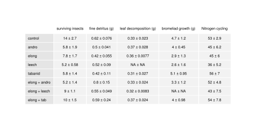

Introduction
------------

Predator assemblages can have strong top-down effects, both on community
structure and ecosystem processes (Estes et al. 2011). Detailed studies
manipulating predators have identified a great diversity of direct and
indirect mechanisms for these effects, related to interspecific
variation in habitat selection and interactions with both prey and other
predators. Within a community predators will have widely different
preferences for different microhabitats, or behavioural responses to
fine-scale environmental variation. When predators do co-occur in a
local patch, they may feed on different prey species as determined by
microhabitat preference, foraging behaviour, and other traits (Schmitz
2007). Predator-predator interactions will further modify the effect of
a diverse consumer assemblage, as predators may feed directly on each
other (Intra-guild predation) or may modify the behaviour of predators
or prey via non-consumptive (ie trait-mediated) interactions (Sih,
Englund, and Wooster 1998; Griswold and Lounibos 2006; Nyström et al.
2001). While there are many mechanisms, we lack a means of estimating
the importance of each in a community. Srivastava et al. (2012)
hypothesized that the phylogenetic diversity of a community or
assemblage may correlate with increased ecosystem function, via
increases in trait diversity; however this has yet to be tested. Here we
quantify phylogenetic diversity (PD) of a diverse invertebrate predator
assemblage and ask if PD is associated with variation in habitat
preferences, diet composition and intraguild interactions.

Phylogenetic diversity measures have provided useful insights into
diverse plant communities (M. W. Cadotte et al. 2009; M. W. Cadotte,
Cardinale, and Oakley 2008; Godoy, Kraft, and Levine 2014), and yet have
rarely been applied to local assemblages of predators (L. Bersier and
Kehrli 2008; Naisbit et al. 2011). Many studies of phylogenetic signal
in consumer traits focus on whole clades, rather than local assemblages
(e.g. *Anolis* lizards (Knouft et al. 2006), warbler (Böhning-Gaese,
Schuda, and Helbig 2003), treeboas (Henderson, Pauers, and Colston 2013)
and wasps (Budriene and Budrys 2004)) making it difficult to connect
these results to top-down effects at the scale of a local community.
While these clade-specific studies often find weak evidence for
phylogenetic signal in ecologically-relevant traits, studies at the
level of the whole biosphere (Gómez, Verdú, and Perfectti 2010; L.
Bersier and Kehrli 2008) demonstrate that related organisms often have
similar interspecific interactions -- i.e. related predators often
consume similar prey. At the level of a community, the effect of a
predator assemblage will depend on both the distribution and trophic
interactions of all predator species. Phylogeny may constrain species
distributions when distant relatives have distinct fundamental niches,
while close relatives are too similar to co-occur (Webb et al. 2002;
Emerson and Gillespie 2008) -- for predators, this means that similar
taxa may not be able to occupy the same compartment of a food web
(Rezende et al. 2009). By correlating with these properties, measures of
phylogenetic diversity may allow us to predict the effect of a predator
assemblage on ecosystem functioning.

Within predator assemblages, there may be considerable variation in the
abundance and distribution of related taxa. If habitat patches are
variable, and if the fundamental niche of different organisms varies
with relatedness, then we would expect a phylogenetic signal to patterns
of occurrence. Specifically, if related predators share habitat
requirements, then we expect to find them in the same patches -- unless
their similarity precludes their co-occurrence. This relationship
between relatedness and distribution is he most common way in which
phylogenetic information is used in community ecology (Cavender-Bares et
al. 2009). In metacommunities -- i.e. when patches are connected by
dispersal -- variation in the composition of a local assemblage is also
determined by species dispersal into, and selection among, habitat
patches (M. A. Leibold et al. 2004; Howeth and Leibold 2010; Calcagno et
al. 2011). The effects of other predators can be important too: during
dispersal, assembly can be nonrandom if predators use cues of presence
of prey, competitors, or intra-guild predators when colonizing (Chase
and Shulman 2009; McCauley et al. 2008; Diane S. Srivastava et al.
2008). After colonization, patterns of co-occurrence may be further
modified by intraguild predation (L. P. Lounibos et al. 2008; Juliano
2009) or competition (Fincke, Yanoviak, and Hanschu 1997).

When predators co-occur, their feeding mode, diet breadth and
nutritional requirements of predators will determine which prey they
consume and the total potential amount of predation that occurs. Because
such morphological traits may well be conserved over evolutionary time,
the breadth of differentiation (and hence resource use) may also show a
phylogenetic signal; this differentiation in resource use leads to
complementarity and greater overall ecosystem function (Finke and Snyder
2008). Among predators, feeding mode is an important trait that is
conserved within lineages and determines a large part of diet breadth.
For example, some predators are gape-limited, and can swallow any prey
smaller than their mouth; these predators typically broaden their diet
as they grow (e.g., larvae of Odonata) (E. Werner and Gilliam 1984).
Such ontogenetic changes in diet breadth can radically influence all of
food web structure (Moya-Laraño 2011). Other predators (e.g. Leeches, or
Diptera:Tabanidae) are "piercing-sucking" predators (Bay 1974) and may
be more general consumers at all life stages, since they an feed on
larger prey individuals even at very early predator life stages. In some
cases, predator diets may extend to include other predators leading to
direct negative interactions such as intraguild predation, which may
also have a phylogenetic signal (Pfennig 2000).

Predator interactions are common in many communities, and can lead to
nonlinearities which prevent the inference of predator effect from the
additive combination of individual predators (Sih, Englund, and Wooster
1998). For example, decreasing predator richness has been shown to
increase herbivory in a three-level kelp food web (Byrnes et al. 2006).
The complex traits that underlie such species interactions (particularly
"higher-order" interactions *sensu* Sih *et al.* (1998)) may also
correlate with phylogeny, leading to a higher correlation with community
processes than richness alone (M. W. Cadotte et al. 2009). For example,
phylogenetically diverse assemblages of mycorrhizae increased primary
productivity more than equally speciose treatments from the same lineage
(Maherali and Klironomos 2007). The effect of predators on prey may also
be non-additive, the result of indirect interactions either with prey
species or other predators: prey species may respond to the presence of
one predator by a behavioural shift that increases the predation by
another predator population (Carey and Wahl 2010). These trait-mediated
indirect effects (E. Werner and Peacor 2003) can be difficult to
predict; however phylogenetic relatedness has been suggested as a
possible means of predicting the combined effect of predators (Naisbit
et al. 2011)

We used a series of observations, lab feeding trials, and manipulative
field experiments to measure how the phylogenetic diversity of the
predator assemblage predicts community composition and ecosystem
function. We test three related hypotheses concerning co-occurance
patterns, diet similarity and top-down ecosystem effects of diverse
predators, using a natural mesocosm: the community of invertebrates
living within bromeliads. Bromeliads (Bromeliaceae) are epiphytic plants
native to the Neotropics; many species contain water, detritus and a
complex insect food web within their leaves; the decomposition of this
detritus supplies nutrients for the bromeliad (Benzing 2000). The small
size of these habitats permits direct manipulations of entire food webs,
manipulations which would be difficult in most natural systems. Within
this aquatic food web, damselfly larvae (e.g. *Leptagrion* spp.,
Odonata:Coenagrionidae) are important predators; their presence
dramatically alters community dynamics (e.g. decreasing rates of insect
emergence (Starzomski, Suen, and Srivastava 2010) and increasing
nutrient cycling (Ngai and Srivastava 2006)).

1.  *species co-occurance*: closely-related predators may occur together
    more frequently than less-related predators if there is a strong
    phylogenetic signal to habitat requirements. Alternatively, very
    closely related species may never co-occur because high overlap in
    ecological niches results in competitive exclusion.

2.  *diet similarity*: similarity in diet (as measured by feeding
    trials) decreases with phylogenetic distance if diet is
    phylogentically conserved. Alternatively, closely related species
    may have evolved different diets to allow coexistence.

3.  *ecosystem-level effects*: Our experiments at the level of the whole
    habitat patch (i.e. a single bromeliad) allows us to examine direct
    and indirect effects of predator combinations.
    -   monoculture treatments allow us to assess the effect of each
        predator on a complete prey community and ecosystem function.
        Phylogenetic similarity among predators may positively correlate
        with similarity in these effects
    -   In our predator combination treatments we force pairs of
        predators to co-occur. If phylogenetic distance is negatively
        correlated with similarity in diet, then increasingly divergent
        pairs should show increased total predation, as they feed on
        different parts of the prey community.
    -   predator combination treatments also allow the estimation of
        non-additive effects, by comparison with monocultures. The
        magnitude of these non-additive effects may increase with
        phylogenetic distance.

Methods
-------

Site and Species
----------------

We conducted all observations and experiments in Parque Estadual da Ilha
do Cardoso (25 ∘ 03′ S,
47 ∘ 53′ W), a 22.5 ha island off the south coast
of São Paulo state, Brazil. We worked in a closed coastal forest
(restinga) the understory of which is mostly covered by *Quesnelia
arvensis* Mez. (Bromeliaceae), a large terrestrial bromeliad that
accumulates up to 2.8 L of rainwater in tanks formed by individual
leaves. More than 47 species of macroinvertebrates are found in these
aquatic communities. This diversity encompasses an entire foodweb, from
detrital shredders (Tipulidae, Trichoptera), detrital scrapers
(Scirtidae), collectors (Chironomidae, Syrphidae, Psychodidae), and
filter feeders (Culicidae) to a diverse predator assemblage consisting
of at least 3 species of *Leptagrion* (Zygoptera:Coenagrionidae), 2
species of predatory fly (Tabanidae), and 2 species of leech
(Hirudinidae). Many other smaller or occasional predators also occur,
such as predatory midges (Chironomidae:Tanypodinae) and Dytiscid
beetles.

### metabolic capacity and phylogenetic distance

In 2008, insects were counted and measured in an observational study of
25 bromeliads. Within this observational dataset, we identified 14
species as predators. These predators vary in taxonomic relatedness:
from congeners -- *Bezzia* sp. (Diptera:Ceratopogonidae) with two
species and *Leptagrion* sp. (Odonata:Coenagrionidae) with three -- to
confamilials (three species of Tabanidae and two of Empididae, all
Diptera). Three families of Diptera are represented by a single species
each: Dolichopodidae, Corethrellidae and Chironomidae. The deepest
taxonomic divide is between all insects present and a species of leech
(Annelida:Hirudinidae).

We obtained node age estimates for all 7 internal nodes of the tree,
using www.timetree.org, an online database of published molecular time
estimates from the literature (Hedges, Dudley, and Kumar 2006). Most
dates came from only a single study; where multiple dates were found we
used the median estimate: Insecta--Hirudina (543 to 700 Mya, n=5
studies), Odonata--Tabanidae (151 to 543 Mya, n=4 studies) and
Tabanidae--Diptera (151 to 543 Mya, n=7 studies). Node age data was
available for all but the shallowest nodes of the tree, where either a
lack of taxonomic information (e.g. Tabanidae) or a lack of phylogenetic
study (e.g. *Leptagrion*) prevented more information from being
included. These branches were left as polytomies, and were all assigned
identical, arbitrary and short branch lengths (15 Mya).

### Observations of predator co-occurance

We used an observational dataset collected in 2008 to examine patterns
of co- occurance among predator taxa. This dataset was collected by
completely dissecting bromeliads and washing all leaves to remove
invertebrates. The resulting water was filtered through two sieves (250
and 850 µm), which removed particulate organic matter without losing any
invertebrates. All invertebrates were counted and identified to the
lowest taxonomic level possible. The body length of all individuals was
measured, when possible.

Because predators in this system vary widely in size, we used "metabolic
capacity", which correlates with predator feeding rate (Brown et al.
2004; Wilby, Villareal, and Lan 2005). We calculated body mass using
allometric equations which related dry biomass to body length. Metabolic
capacity is calculated as the sum of individual body mass raised to the
power of 0.69; this reflects the nonlinearity of feeding rate on body
size across many invertebrate taxa. We calculated total metabolic
capacity of each predator species in each bromeliad by summing estimates
for all individuals of the same species within a plant. We quantified
"coexistence" as a distance measure: the euclidian distance among the
total metabolic capacity among occupied bromeliads.

### Diet similarity

We conducted 232 feeding trials of 7 predator taxa fed 14 prey taxa
between March and April 2011. We covered all potential predator-prey
pairs present in the experiment (described below), and attempted to
perform all other trials whenever possible. However, due to the rarity
of some taxa many predator-prey pairs were not possible; we tested 41
pairwise combinations. Most trials were replicated at least 5 times, but
the number of replicates for various combinations ranged from 1 to 11.
We placed predators together with prey in a 50ml vial, with a leaf or
stick for substrate. The only exception was the tabanid larvae, which we
placed between two vertical surfaces to imitate the narrow space found
in bromeliad leaf axils, their preferred microhabitat. Generally our
trials contained a single predator and a single prey individual, except
in the case of very small prey (*Elpidium* sp.) or predators
(*Monopelopia* sp.) in which case we increased the density. We
replicated each combination up to 5 times where possible, and allowed 1
day for predation to occur.

We evaluated overlap in predator diet preference using Pianka (1973
CITE) 's index of niche overlap :

\$O\_{kl}=\\dfrac{\\sum\_i\^n{p\_{il} p\_{ik}}}{\\sqrt{\\sum\_i\^n{p\_{il}\^2} \\sum\_i\^n{p\_{ik}\^2}}}\$

For each pair of predators, *p**i**k* and
*p**i**l* represent the preference of predator *k* (r *l*)
for prey species *i*. The number of prey species (*n*) is defined as the
total number of prey species assayed with both predator taxa, and
preference is defined as the proportion of trials for each predator-prey
assay that resulted in prey mortality.

### Community effect experiment

<!-- Abundance-based phylogenetic diversity measure : convert to metabolic capacity based?? 
  [@Cadotte2010] -->

Our experiment was created with two goals in mind: first, to measure the
major effects of these predators on their prey and second, to estimate
the non- additive effects of pairwise predator combinations. The
strength of these non additive effects can then be related back to the
phylogenetic distance between each member of a pair of predators.

We selected the most common predators in this system, which also created
a range of relatedness: two congeneric damselflies (*Leptagrion
andromache* and *Leptagrion elongatum*), two insects (*L. elongatum* and
a Tabanid predatory fly), and two invertebrates (*L. elongatum* and
leeches). We used each of the pairs of predators just described, as well
as each species in monoculture, and a predator-free control (8
treatments, n=5). Combinations were substitutive, maintaining the same
amount of total predator metabolic capacity to isolate the effects of
predator behaviour and traits. Response variables included the rate of
decomposition of leaves, bromeliad growth and insect emergence. This
experiment allows the estimation of the effect of each predator species
(monoculture treatments), as well as the detection of non- additive
effects in predator combinations.

In Feburary 2011, bromeliads between 90 and 200ml were collected,
thoroughly washed and soaked for 12 hours in a tub of water. They were
then hung for 48 hours to dry. One bromeliad dissected after this
procedure contained no insects.

Each bromeliad was supplied with dried leaves, simulating natural
detritus inputs from the canopy. We enriched these leaves with N-15 by
fertilizing five (Jabuticaba, *Plinia cauliflora*) plants with 40ml
pot-1 day-1 of 5g/L ammonium sulphate containing
10% atom excess of N15. *duration*. started on 27 January 2011 Whole
leaves were then picked from plants and air-dried until constant weight,
and then soaked for three days and the water discarded. About 1.5 g of
leaves were placed in each bromeliad (1.5006g ± 0.0248).

Each bromeliad was stocked with a representative insect community. The
densities of each prey taxon were calculated from the 2008 observational
dataset, using data from bromeliads of similar size to those in our
experiment. All densities used were within the range of these calculated
abundances, and all experimental bromeliads received the same insect
community. Halfway through the experiment, insects were added to
bromeliads a second time to simulate the continuous oviposition that
characterizes the system. After addition of the prey community, all
bromeliads were enclosed with a mesh cage topped with a malaise trap and
checked daily for emergence of adults.

In this experiment we measured five response variables: production of
fine particulate organic matter (FPOM), decomposition of coarse
detritus, bromeliad growth, cycling of nitrogen into plant tissue, and
survival of prey (emerged adults + surviving larvae). We analyzed each
of these responses with ANOVA. We calculated the non-additive response
as follows: the difference between the polyculture mean (n=5) and the
mean of both monoculture means for each predator (n=5 for each
monoculture). We generated bootstrap confidence intervals for these
nonadditive effects; confidence intervals which do not overlap zero
indicate a significant nonadditive effect of a predator combination.

Results
-------

### patterns of occurance

Across all bromeliads, predator species differed widely in metabolic
capacity, from 4.5 × 10-4 for a species of *Monopelopia* to
0.15 for large predatory flies in the family Tabanidae. Predators often
co-occured in bromeliads (4.4 ± 2.9 species per plant). However, the
euclidian distance between the total metabolic capacity of two predators
did not show any relationship with phylogenetic distance between them
(F1,89=1.5558, p=0.22).

### diet similarity

Among the most common predator taxa (i.e. those used in our experiment,
described below) the damselflies (*Leptagrion andromache* and
*Leptagrion elongatum*) showed the highest rates of prey consumption
(prey consumed in 94.3% and 67.2% of trials, respectively). All
predators showed a very generalist diet breadth, consuming nearly all
species offered to them. However, more phylogenetically distant
predators differed in their preference of prey species, as measured by
the niche overlap index (F1,\\ 19=6.72, p=0.018, regression
weighted by the number of prey species assayed.)

### Ecosystem-level effects and phylogenetic distance

In our manipulative experiment, we placed a standardized prey community
into bromeliads and measured five response variables. Predators had a
large effect on prey survivorship: on average all predator treatments
showed 51% lower prey emerging or surviving as larvae relative to the
predator-free control. Nitrogen transport to bromeliad leaves was
slightly decreased relative to controls (-11%), and was only higher than
the control in treatments including Tabanid predators. We found a
similar pattern for plant growth: on average, predators had a -18%
effect on growth of bromeliad leaves (mm), though Tabanids seemed to
create a slight increase. The decomposition of coarse detritus and
production of fine organic matter showed no obvious pattern related to
the mere presence of predators.

<!--
Add stats to above paragraph: the two "orthogonal" questions of how predators affect communities independently and how they affect them non-additively (in combination)  
-->

<!--
stats in following paragraph!  
-->

Predator combinations tended to have a non-additive effect on our
response variables, even though we held total metabolic capacity
constant amongst all treatments. Approximately 14% more prey survived in
polyculture, on average, compared to all monocultures. Nitrogen uptake
increased by (8%) and bromeliad growth by (11%). Production of fine
particulate organic matter increased by 29% more when predators were
present in combination.

Our experimental design allows us to estimate the non-additive effect of
predator species pairs on whole communities of prey, and the functioning
of the bromeliad ecosystem. We used randomization tests to test the
hypothesis that increased phylogenetic distance between members of a
predator pair results in a greater magnitude of nonadditive effect. We
contrasted the differences of the mean individual predator treatments
from the control with the mean difference of their pairwise combination
from the control.  
<!-- previous sentence rather complex-sounding. how about an equation? -->
<!-- need stats for these response variables, too -->

We found the greatest effect for prey survival: while effects of *L.
andromache* and *L. elongatum* in combination were quite similar to the
effect of either alone, when *L. elongatum* was placed in the same plant
as either a Tabanid larva or leeches, on average 5 more prey (18% of
total prey community) survived till the end of the experiment (Fig 3).
This effect was smaller among the other variables, most of which showed
confidence intervals from the randomization test which overlap 0.

### Figures

Discussion
----------

### co-occurrence

Predators appear to be generalist with regard to their habitat
preference; indicating that prey face a heterogeneous landscape of
predator risks, and demonstrating that our experimental design captures
natural variation in predator composition

Predators occurring together at smaller spatial scales (i.e. within the
same plant) may have limited direct interactions due to habitat
structure, for example via the physical obstructions caused by detritus
(). Srivastava found that such habitat complexity within a bromeliad --
specifically the presence of coarse detritus -- reduces the amount of
predation by damselflies. It is not clear how these factors might
influence the other predators in this system. Effects might be similar
for leeches, which are also active predators. Tabanids are sit-and-wait
predators, living deep in leaf axils, so it is likely that they are less
affected by local patch structural conditions than other predators.

two important steps -- oviposition decisions and survival -- determine
organism coexistence in bromeliad patches.

Predator lifecycles can be quite long in this system, much longer than
the lives of invertebrate prey (Robin). As a result, actively dispersing
inverts are probably faced with choices among various predation-risks in
patches. While this is beyond the sope of our work, we report evidence
for both strong IGp nonliearities in predation amount, and a broad
overlap in predator co-occurance. This indicates that, at the level of
the metacommunity, discrete patches have varying amounts of predator
biomass, which may not necessarily correlate with the amount of
predation pressure they may face.

Habitat selection is difficult to ascertain from observational data.
Especially given that animals in this system have difference lifecycles.
The insects are rapidly changing (smaller insects) while large predators
may say or a while,and physical detritus longer still.

hm. there's an idea: if there is IGP or TMII among predators, that means
composition or biomass of predators can be decoupled from predation
rate. That could lead to strange decisions by insects, with nonintuitive
results.

### diet similarity

-   We demonstrate a slight but important decrease in feeding
    preferences with phylogenetic distance, indicating that food web
    structure itself might vary with phylogenetic diversity, becoming
    more compartmentalized when predators are more dissimilar.

calulate predatr's feeding rate nd diet breath simultaneously, and
relate this to their phylogenetic distance from each other. could be
that there is a phylgenetic signal in the prey eaten? not really our
focus here. in fact we are more interested in whether similar predators
have similar effects on communities.

-   The differences in predation rates and diet breadth among our
    predators represents important trait differences between the groups
    involved, including differences in metabolic rate (physiological
    literature) and feeding mode. (for example, Tabanids and leeches are
    peircing predators, while Leptagrion is gape-limited.)

Diet similarity, like occurance, also has two components: predator

### community experiment

-   Phylogenetically diverse predator assemblages showed more prey
    survivorship (i.e. less predation) than expected; this may be to
    strong trait-mediated indirect effects on the feeding rate of
    *Leptagrion elongatum* when in the presence of other non-damselfly
    predators.

Trait-mediated indirect effects may be common in nature (E. Werner and
Peacor 2003). In our system we observed less predation in predator
combinations, perhaps because the damselflies lowered their predation
rates when they were exposed to other predators. Trait mediated
interactions might be frequent in this system: for example, in close
quarters of bromeliads it may be more likely that predators are aware of
each other's densities. Physical touch and chemical cues can both be
frequent cues for the presence of predators, and can trigger
trait-mediated-effects. In bromeliads, a diverse community occurs at a
very small spatial scale and diverse predators are quite likely to
overlap. Such predator-induced decreases in feeding might actually be
common, although we would not estimate them directly by densities of
predators (E. Werner and Peacor 2003).

-   Feeding differences between predators, combined with their patchy
    but unpredictable distribution among bromeliads, creates a large
    variation in food web structure and total amount of predation per
    patch within this bromeliad metacommunity

Predators have different feeding rates, feed in different parts of the
bromeliad, and have different effects on each other. The presence of a
predator with a low feeding rate may have a strong positive effect on
prey survival, if it decreases the predation rate of *Leptagrion* sp..
This uncouples predation rate and predator biomass, and creates a
constantly changing amount of top-down regulation in this system. These
predators might also differ in dispersal rates, and in vulnerability to
other predators. for example, Leptagrion spp are frequent prey for
semi-aquatic spiders, but tabanids are likely safe from most large
predators because of their position deep in leaf axils.

-   In response to predator manipulations we observed less transfer of
    Nitrogen into bromeliad tissue than did Ngai and Srivastava (2006);
    this may be due to a greater role for bacterial decomposition in
    this system (cite?).

Insects sometimes can be the major group which determines the speed of
decomposition. However, when substrate is very recalcitrant the insects
are only able to break down small amounts of detritus. In restingas, the
leaves are very thick and waxy, a possible adaptation to the poor
growing conditions. As a result, invertebrates in this system do not eat
the leaves directly; rather microinverterbrates (zooplankton) and
bacteria do most of the decomposition. This hypothesis could be tested,
for example, by performing bacterial community "transplants" from a host
bromelid to a sterile bromeliad, which could then be monitored for a
decomposition rate similar to the original bromeliad. Ngai et al
hypothesized that their increase in nutrient cycling that they observed
was due to increased mortality of insects, and that bromeliads were
absorbing N from odonate predator waste. In our system, a more diverse
predator community leaves different kinds of dead prey, and also
different dead insects. Tabanids are primarily sucking predators, which
leave the integument of their prey behind. The waste products of these
different predators might also be very different, depending on the
physiology and nutrient requirements and efficienty of each predator.

Leaf decomposition does not show a strong relationship with bromeliad
size in Cardoso, even though there is a strong relationship in Costa
Rica (Robin)

It may be that different predators influence the composition of the
detritus (animal, fecal and leaf), and that this bottom-up effect
determines the success of different taxa, as well as rates of nutrient
cycling.

Supplementary
-------------

<table>
<caption>Densities of insects used in the experiment.</caption>
<thead>
<tr class="header">
<th align="center">Species</th>
<th align="center">density</th>
</tr>
</thead>
<tbody>
<tr class="odd">
<td align="center"><em>Chironomus detriticula</em></td>
<td align="center">10</td>
</tr>
<tr class="even">
<td align="center"><em>Polypedium sp. 1</em></td>
<td align="center">4</td>
</tr>
<tr class="odd">
<td align="center"><em>Polypedium sp. 2</em></td>
<td align="center">2</td>
</tr>
<tr class="even">
<td align="center"><em>Psychodid sp. 1</em></td>
<td align="center">1</td>
</tr>
<tr class="odd">
<td align="center"><em>Scyrtes sp. A</em></td>
<td align="center">5</td>
</tr>
<tr class="even">
<td align="center"><em>Culex spp.</em></td>
<td align="center">4</td>
</tr>
<tr class="odd">
<td align="center"><em>Trentepholia sp.</em></td>
<td align="center">1</td>
</tr>
</tbody>
</table>

--\>

References
----------

Bay, EC. 1974. “Predator-Prey Relationships Among Aquatic Insects.”
*Annual Review of Entomology* (19): 441–453.
<http://www.annualreviews.org/doi/pdf/10.1146/annurev.en.19.010174.002301>.

Benzing, David H. 2000. *Bromeliaceae: Profile of an Adaptive
Radiation*. Cambridge University Press.
<http://www.amazon.com/Bromeliaceae-Adaptive-Radiation-David-Benzing/dp/0521430313>.

Bersier, L, and P Kehrli. 2008. “The Signature of Phylogenetic
Constraints on Food-Web Structure.” *Ecological Complexity* 5 (2)
(June): 132–139.
doi:[10.1016/j.ecocom.2007.06.013](http://dx.doi.org/10.1016/j.ecocom.2007.06.013).
<http://linkinghub.elsevier.com/retrieve/pii/S1476945X08000093>.

Böhning-Gaese, K, M D Schuda, and a J Helbig. 2003. “Weak Phylogenetic
Effects on Ecological Niches of Sylvia Warblers.” *Journal of
Evolutionary Biology* 16 (5) (September): 956–65.
<http://www.ncbi.nlm.nih.gov/pubmed/14635911>.

Brown, James H., James F. Gillooly, Andrew P. Allen, Van M. Savage, and
Geoffrey B. West. 2004. “Toward a Metabolic Theory of Ecology.”
*Ecology* 85 (7) (July): 1771–1789.
doi:[10.1890/03-9000](http://dx.doi.org/10.1890/03-9000).
<http://www.esajournals.org/doi/abs/10.1890/03-9000>.

Budriene, A, and E Budrys. 2004. “Hunting Behaviour of Predatory Wasps
(Hymenoptera: Vespidae: Eumeninae): Is the Distribution of Stinging
Effort Phylogenetically Inherited or Dependent on the Prey.” *Annales de
La Société Entomologique de …* 40 (4): 259–268.
<http://www.tandfonline.com/doi/abs/10.1080/00379271.2004.10697424>.

Byrnes, Jarrett, John J Stachowicz, Kristin M Hultgren, a Randall
Hughes, Suzanne V Olyarnik, and Carol S Thornber. 2006. “Predator
Diversity Strengthens Trophic Cascades in Kelp Forests by Modifying
Herbivore Behaviour.” *Ecology Letters* 9 (1) (January): 61–71.
doi:[10.1111/j.1461-0248.2005.00842.x](http://dx.doi.org/10.1111/j.1461-0248.2005.00842.x).
<http://www.ncbi.nlm.nih.gov/pubmed/16958869>.

Cadotte, Marc W., Bradley J Cardinale, and Todd H Oakley. 2008.
“Evolutionary History and the Effect of Biodiversity on Plant
Productivity.” *Proceedings of the National Academy of Sciences of the
United States of America* 105 (44) (November): 17012–7.
doi:[10.1073/pnas.0805962105](http://dx.doi.org/10.1073/pnas.0805962105).
[http://www.pubmedcentral.nih.gov/articlerender.fcgi?artid=2579369\\&tool=pmcentrez\\&rendertype=abstract](http://www.pubmedcentral.nih.gov/articlerender.fcgi?artid=2579369\&tool=pmcentrez\&rendertype=abstract).

Cadotte, Marc W., Jeannine Cavender-Bares, David Tilman, and Todd H
Oakley. 2009. “Using Phylogenetic, Functional and Trait Diversity to
Understand Patterns of Plant Community Productivity.” *PloS One* 4 (5)
(January): e5695.
doi:[10.1371/journal.pone.0005695](http://dx.doi.org/10.1371/journal.pone.0005695).
<http://www.ncbi.nlm.nih.gov/pubmed/19479086>.

Calcagno, Vincent, François Massol, Nicolas Mouquet, Philippe Jarne, and
Patrice David. 2011. “Constraints on Food Chain Length Arising from
Regional Metacommunity Dynamics.” *Proceedings. Biological Sciences /
The Royal Society* (iv) (March).
doi:[10.1098/rspb.2011.0112](http://dx.doi.org/10.1098/rspb.2011.0112).
<http://www.ncbi.nlm.nih.gov/pubmed/21367786>.

Carey, Michael P, and David H Wahl. 2010. “Interactions of Multiple
Predators with Different Foraging Modes in an Aquatic Food Web.”
*Oecologia* 162 (2) (February): 443–52.
doi:[10.1007/s00442-009-1461-3](http://dx.doi.org/10.1007/s00442-009-1461-3).
<http://www.ncbi.nlm.nih.gov/pubmed/19777265>.

Cavender-Bares, Jeannine, Kenneth H Kozak, Paul V a Fine, and Steven W
Kembel. 2009. “The Merging of Community Ecology and Phylogenetic
Biology.” *Ecology Letters* 12 (7) (July): 693–715.
doi:[10.1111/j.1461-0248.2009.01314.x](http://dx.doi.org/10.1111/j.1461-0248.2009.01314.x).
<http://www.ncbi.nlm.nih.gov/pubmed/19473217>.

Chase, Jonathan M., and Rachel S. Shulman. 2009. “Wetland Isolation
Facilitates Larval Mosquito Density Through the Reduction of Predators.”
*Ecological Entomology* 34 (6) (December): 741–747.
doi:[10.1111/j.1365-2311.2009.01128.x](http://dx.doi.org/10.1111/j.1365-2311.2009.01128.x).
<http://doi.wiley.com/10.1111/j.1365-2311.2009.01128.x>.

Emerson, Brent C, and Rosemary G Gillespie. 2008. “Phylogenetic Analysis
of Community Assembly and Structure over Space and Time.” *Trends in
Ecology & Evolution (Personal Edition)* 23 (11) (November): 619–30.
doi:[10.1016/j.tree.2008.07.005](http://dx.doi.org/10.1016/j.tree.2008.07.005).
<http://www.ncbi.nlm.nih.gov/pubmed/18823678>.

Estes, James a, John Terborgh, Justin S Brashares, Mary E Power, Joel
Berger, William J Bond, Stephen R Carpenter, et al. 2011. “Trophic
Downgrading of Planet Earth.” *Science (New York, N.Y.)* 333 (6040)
(July): 301–6.
doi:[10.1126/science.1205106](http://dx.doi.org/10.1126/science.1205106).
<http://www.ncbi.nlm.nih.gov/pubmed/21764740>.

Fincke, OM, SP Yanoviak, and RD Hanschu. 1997. “Predation by Odonates
Depresses Mosquito Abundance in Water-Filled Tree Holes in Panama.”
*Oecologia* 112: 244–253.
<http://link.springer.com/article/10.1007/s004420050307>.

Finke, Deborah L, and William E Snyder. 2008. “Niche Partitioning
Increases Resource Exploitation by Diverse Communities.” *Science (New
York, N.Y.)* 321 (5895) (September): 1488–90.
doi:[10.1126/science.1160854](http://dx.doi.org/10.1126/science.1160854).
<http://www.ncbi.nlm.nih.gov/pubmed/18787167>.

Godoy, Oscar, Nathan J. B. Kraft, and Jonathan M. Levine. 2014.
“Phylogenetic Relatedness and the Determinants of Competitive Outcomes.”
Edited by Jerome Chave. *Ecology Letters* (April): n/a–n/a.
doi:[10.1111/ele.12289](http://dx.doi.org/10.1111/ele.12289).
<http://doi.wiley.com/10.1111/ele.12289>.

Gómez, José M., Miguel Verdú, and Francisco Perfectti. 2010. “Ecological
Interactions Are Evolutionarily Conserved Across the Entire Tree of
Life.” *Nature* 465 (June) (June).
doi:[10.1038/nature09113](http://dx.doi.org/10.1038/nature09113).
<http://www.nature.com/doifinder/10.1038/nature09113>.

Griswold, Marcus W, and L Philip Lounibos. 2006. “Predator Identity and
Additive Effects in a Treehole Community.” *Ecology* 87 (4) (April):
987–95.
[http://www.pubmedcentral.nih.gov/articlerender.fcgi?artid=1820834\\&tool=pmcentrez\\&rendertype=abstract](http://www.pubmedcentral.nih.gov/articlerender.fcgi?artid=1820834\&tool=pmcentrez\&rendertype=abstract).

Hedges, S Blair, Joel Dudley, and Sudhir Kumar. 2006. “TimeTree: a
Public Knowledge-Base of Divergence Times Among Organisms.”
*Bioinformatics (Oxford, England)* 22 (23) (December): 2971–2.
doi:[10.1093/bioinformatics/btl505](http://dx.doi.org/10.1093/bioinformatics/btl505).
<http://www.ncbi.nlm.nih.gov/pubmed/17021158>.

Henderson, Robert W., Michael J. Pauers, and Timothy J. Colston. 2013.
“On the Congruence of Morphology, Trophic Ecology, and Phylogeny in
Neotropical Treeboas (Squamata: Boidae: Corallus ).” *Biological Journal
of the Linnean Society* 109 (2) (June): 466–475.
doi:[10.1111/bij.12052](http://dx.doi.org/10.1111/bij.12052).
<http://doi.wiley.com/10.1111/bij.12052>.

Howeth, Jennifer G, and Mathew a Leibold. 2010. “Species Dispersal Rates
Alter Diversity and Ecosystem Stability in Pond Metacommunities.”
*Ecology* 91 (9) (September): 2727–41.
<http://www.ncbi.nlm.nih.gov/pubmed/20957966>.

Juliano, SA. 2009. “Species Interactions Among Larval Mosquitoes:
context Dependence Across Habitat Gradients.” *Annual Review of
Entomology*: 37–56.
doi:[10.1146/annurev.ento.54.110807.090611.Species](http://dx.doi.org/10.1146/annurev.ento.54.110807.090611.Species).
<http://www.ncbi.nlm.nih.gov/pmc/articles/pmc2664081/>.

Knouft, JH, JB Losos, RE Glor, and JJ Kolbe. 2006. “Phylogenetic
Analysis of the Evolution of the Niche in Lizards of the Anolis Sagrei
Group.” *Ecology* 87 (7).
[http://www.esajournals.org/doi/abs/10.1890/0012-9658(2006)87[29:PAOTEO]2.0.CO;2 http://www.esajournals.org/doi/abs/10.1890/0012-9658(2006)87\\%5B29:PAOTEO\\%5D2.0.CO\\%3B2](http://www.esajournals.org/doi/abs/10.1890/0012-9658(2006)87[29:PAOTEO]2.0.CO;2 http://www.esajournals.org/doi/abs/10.1890/0012-9658(2006)87\%5B29:PAOTEO\%5D2.0.CO\%3B2).

Leibold, M A, M Holyoak, N Mouquet, P Amarasekare, Jonathan M. Chase, M
F Hoopes, R D Holt, et al. 2004. “The Metacommunity Concept: a Framework
for Multi-Scale Community Ecology.” *Ecology Letters* 7 (7): 601–613.
doi:[10.1111/j.1461-0248.2004.00608.x](http://dx.doi.org/10.1111/j.1461-0248.2004.00608.x).
<http://www.blackwell-synergy.com/links/doi/10.1111/j.1461-0248.2004.00608.x>.

Lounibos, L P, S Makhni, B W Alto, and B Kesavaraju. 2008. “Surplus
Killing by Predatory Larvae of Corethrella Appendiculata: Prepupal
Timing and Site-Specific Attack on Mosquito Prey.” *Journal of Insect
Behavior* 21 (2) (March): 47–54.
doi:[10.1007/s10905-007-9103-2](http://dx.doi.org/10.1007/s10905-007-9103-2).
[http://www.pubmedcentral.nih.gov/articlerender.fcgi?artid=2600435\\&tool=pmcentrez\\&rendertype=abstract](http://www.pubmedcentral.nih.gov/articlerender.fcgi?artid=2600435\&tool=pmcentrez\&rendertype=abstract).

Maherali, Hafiz, and John N Klironomos. 2007. “Influence of Phylogeny on
Fungal Community Assembly and Ecosystem Functioning.” *Science (New
York, N.Y.)* 316 (5832) (June): 1746–8.
doi:[10.1126/science.1143082](http://dx.doi.org/10.1126/science.1143082).
<http://www.ncbi.nlm.nih.gov/pubmed/17588930>.

McCauley, Shannon J, Christopher J Davis, Rick a Relyea, Kerry L
Yurewicz, David K Skelly, and Earl E Werner. 2008. “Metacommunity
Patterns in Larval Odonates.” *Oecologia* 158 (2) (November): 329–42.
doi:[10.1007/s00442-008-1141-8](http://dx.doi.org/10.1007/s00442-008-1141-8).
<http://www.ncbi.nlm.nih.gov/pubmed/18781330>.

Moya-Laraño, Jordi. 2011. “Genetic Variation, Predator-Prey Interactions
and Food Web Structure.” *Philosophical Transactions of the Royal
Society of London. Series B, Biological Sciences* 366 (1569) (May):
1425–37.
doi:[10.1098/rstb.2010.0241](http://dx.doi.org/10.1098/rstb.2010.0241).
[http://www.pubmedcentral.nih.gov/articlerender.fcgi?artid=3081571\\&tool=pmcentrez\\&rendertype=abstract](http://www.pubmedcentral.nih.gov/articlerender.fcgi?artid=3081571\&tool=pmcentrez\&rendertype=abstract).

Naisbit, Russell E, Patrik Kehrli, Rudolf P Rohr, and Louis-Félix
Bersier. 2011. “Phylogenetic Signal in Predator-Prey Body-Size
Relationships.” *Ecology* 92 (12) (December): 2183–9.
<http://www.ncbi.nlm.nih.gov/pubmed/22352156>.

Ngai, Jacqueline T., and Diane S. Srivastava. 2006. “Predators
Accelerate Nutrient Cycling in a Bromeliad Ecosystem.” *Science* 314
(5801): 963. <http://www.sciencemag.org/content/314/5801/963.short>.

Nyström, P, O Svensson, B Lardner, C Brönmark, and W Granéli. 2001. “The
Influence of Multiple Introduced Predators on a Littoral Pond
Community.” *Ecology* 82 (4): 1023–1039.
doi:[ http://dx.doi.org/10.1890/0012-9658(2001)082[1023:TIOMIP]2.0.CO;2](http://dx.doi.org/. http://dx.doi.org/10.1890/0012-9658(2001)082[1023:TIOMIP]2.0.CO;2).
[http://www.esajournals.org/doi/abs/10.1890/0012-9658(2001)082\\%5B1023:TIOMIP\\%5D2.0.CO\\%3B2](http://www.esajournals.org/doi/abs/10.1890/0012-9658(2001)082\%5B1023:TIOMIP\%5D2.0.CO\%3B2).

Pfennig, Dw. 2000. “Effect of Predator-Prey Phylogenetic Similarity on
the Fitness Consequences of Predation: A Trade-Off Between Nutrition and
Disease?” *The American Naturalist* 155 (3) (March): 335–345.
doi:[10.1086/303329](http://dx.doi.org/10.1086/303329).
<http://www.ncbi.nlm.nih.gov/pubmed/10718730>.

Rezende, Enrico L, Eva M Albert, Miguel a Fortuna, and Jordi Bascompte.
2009. “Compartments in a Marine Food Web Associated with Phylogeny, Body
Mass, and Habitat Structure.” *Ecology Letters* 12 (8) (August): 779–88.
doi:[10.1111/j.1461-0248.2009.01327.x](http://dx.doi.org/10.1111/j.1461-0248.2009.01327.x).
<http://www.ncbi.nlm.nih.gov/pubmed/19490028>.

Schmitz, Oswald J. 2007. “Predator Diversity and Trophic Interactions.”
*Ecology* 88 (10): 2415–2426.
<http://www.esajournals.org/doi/abs/10.1890/06-0937.1>.

Sih, Andrew, Goran Englund, and David Wooster. 1998. “Emergent Impacts
of Multiple Predators on Prey.” *Trends in Ecology & Evolution* 13 (9):
350–355.
<http://linkinghub.elsevier.com/retrieve/pii/S0169534798014372>.

Srivastava, Diane S, Marc W Cadotte, a Andrew M MacDonald, Robin G
Marushia, and Nicholas Mirotchnick. 2012. “Phylogenetic Diversity and
the Functioning of Ecosystems.” *Ecology Letters* 15 (7) (July): 637–48.
doi:[10.1111/j.1461-0248.2012.01795.x](http://dx.doi.org/10.1111/j.1461-0248.2012.01795.x).
<http://www.ncbi.nlm.nih.gov/pubmed/22583836>.

Srivastava, Diane S., M K Trzcinski, B a Richardson, and B Gilbert.
2008. “Why Are Predators More Sensitive to Habitat Size Than Their Prey?
Insights from Bromeliad Insect Food Webs.” *The American Naturalist* 172
(6) (December): 761–71.
doi:[10.1086/592868](http://dx.doi.org/10.1086/592868).
<http://www.ncbi.nlm.nih.gov/pubmed/18956977>.

Starzomski, Brian M., Daryl Suen, and Diane S. Srivastava. 2010.
“Predation and Facilitation Determine Chironomid Emergence in a
Bromeliad-Insect Food Web.” *Ecological Entomology* 35 (1) (February):
53–60.
doi:[10.1111/j.1365-2311.2009.01155.x](http://dx.doi.org/10.1111/j.1365-2311.2009.01155.x).
<http://doi.wiley.com/10.1111/j.1365-2311.2009.01155.x>.

Webb, Campbell O., David D. Ackerly, Mark a. McPeek, and Michael J.
Donoghue. 2002. “Phylogenies and Community Ecology.” *Annual Review of
Ecology and Systematics* 33 (1) (November): 475–505.
doi:[10.1146/annurev.ecolsys.33.010802.150448](http://dx.doi.org/10.1146/annurev.ecolsys.33.010802.150448).
<http://arjournals.annualreviews.org/doi/abs/10.1146/annurev.ecolsys.33.010802.150448>.

Werner, EE, and JF Gilliam. 1984. “The Ontogenetic Niche and Species
Interactions in Size-Structured Populations.” *Annual Review of Ecology
and Systematics* (15): 393–425. <http://www.jstor.org/stable/2096954>.

Werner, EE, and SD Peacor. 2003. “A Review of Trait-Mediated Indirect
Interactions in Ecological Communities.” *Ecology* 84 (5): 1083–1100.
[http://www.esajournals.org/doi/abs/10.1890/0012-9658(2003)084\\%5B1083:AROTII\\%5D2.0.CO\\%3B2](http://www.esajournals.org/doi/abs/10.1890/0012-9658(2003)084\%5B1083:AROTII\%5D2.0.CO\%3B2).

Wilby, A, SC Villareal, and LP Lan. 2005. “Functional Benefits of
Predator Species Diversity Depend on Prey Identity.” *Ecological …*:
497–501.
<http://onlinelibrary.wiley.com/doi/10.1111/j.0307-6946.2005.00717.x/full>.
