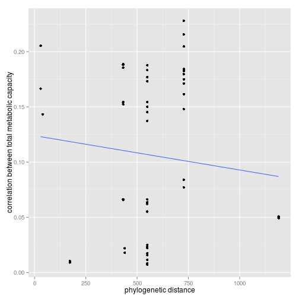
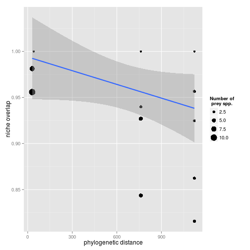
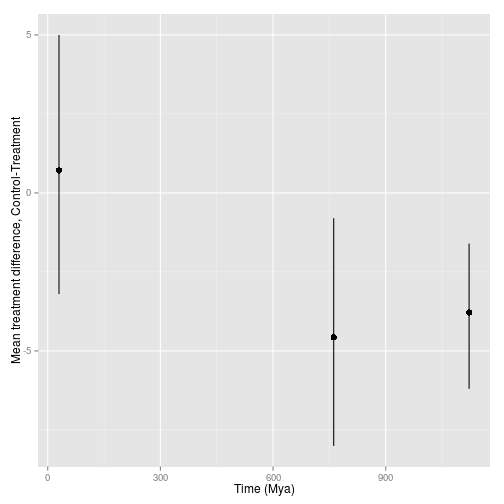
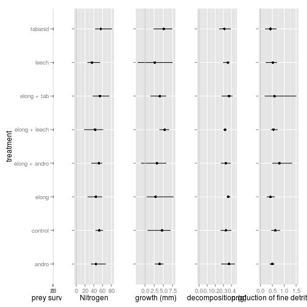

%Predator phylogenetic diversity decreases predation rate via antagonistic interactions
%A. Andrew M. MacDonald, Diane S. Srivastava, Gustavo Q. Romero


## Introduction


<!-- 
Predators are present in most ecosystems, and are important functional groups in determining ecosystem function.  While predator-prey relationships have been studied for a long time, we understand little of the effects of predator diversity on whole communites and ecosystems.  Phylogenetic diversity of plants may correlates well with community level variables, but as yet studies of predator combinations rarely use measures of predator phylogenetic diversity.  In our study we present results from patterns of predator co-occurance, feeding trials, finally a community-level experiment in which we directly manipulated phylogenetic diversity of predators.  In each we ask if the phylogenetic distance between predators is related to similarity, or if diversity is correlated with effect on ecosystem function
.
Decreasing predator richness has been shown to increase herbivory [@Byrnes2006] in a three-level kelp food web.  As these authors point out, the effect of diversity on ecosystem functioning is better known for lower tropic levels, rather than predators.   
Predator combinations can have many different outcomes.  From the perspective of ecosystem function it is important to consider whether these result in more or less top-down control.  Predator effects can be direct via changes in consumption, indirect via non-consumptive effects.  in other words, it can be via the effects of predators on each other, or on their prey, and directly or indirectly.  Therefore, in our experiment we tracked both predator and prey survival to the end of the experiment

for example, predators can kill each other, or decrease feeding rates. 
-->

We test three related hypotheses: 

1. *species co-occurance*: closely-related predators occur together more frequently than less-related predators, due to their similar habitat requirements.  Additionally, very closely related species never co-occur because they are  too similar.

2. *diet similarity*: similarity in diet (as measured by feeding trials) decreases with phylogenetic distance.

3. *ecosystem-level effects*: similarity in the effect of predators on whole ecosystems declines with phylogenetic distance.  Additionally, the non-additive effect of predators will have a greater absolute value when their phylogenetic diversity is larger.


## Methods

<!-- 
We combined predators together in species pairs that represented a
range of relatedness: congeners (two congeneric damselflies,
*Leptagrion andromache* and *Leptagrion elongatum*), two
insects (a damselfly, *L. elongatum* and a predatory fly
(Diptera: Tabanidae)) and two invertebrates (*L. elongatum* and
leeches).  We also included these four species in monoculture, along
with a predator-free control (8 treatments, n=5).  Combinations were
substitutive, maintaining the same amount of predator metabolic
capacity (biomass raised to the power of 0.69, predicting the scaling
of metabolism with body mass [@Brown2004]) in each.  Response
variables included the rate of decomposition of leaves, bromeliad
growth and insect emergence.  This experiment allows the estimation of
the effect of each predator species from monoculture treatments, as
well as the detection of non-additive effects in predator
combinations. 

In Feburary 2011, bromeliads between 90 and 200ml were collected,
thoroughly washed and soaked for 12 hours in a tub of water.  They
were then hung for 48 hours to dry.  One bromeliad dissected after
this procedure contained no insects.

Each bromeliad was supplied with dried leaves, simulating natural
detritus inputs from the canopy.  We enriched these leaves with N-15
by fertilizing five (Jabuticaba, *Plinia cauliflora*) plants with
40ml/pot/day of 5g/L ammonium sulphate containing 10 percent atom
excess of N15. *duration*. started on 27/1/2011
Whole leaves were then picked from plants and air-dried until constant
weight, and then soaked for three days and the water discarded.  About
1.5 g of leaves were placed in each bromeliad (1.5006 ± 0.0248). 

Each bromeliad was stocked with a representative insect community.
The densities of each prey taxon were calculated from a 2008
observational dataset, using data from bromeliads of similar size to
those in our experiment (DS Srivastava, upub. data).  All densities
used were within the range of these calculated abundances, and all
experimental bromeliads received the same insect community.  Halfway
through the experiment, insects were added to bromeliads a second
time.

\begin{table}
  \centering
  \caption{densities of each species}
  \label{tab:sppden}
  \begin{tabular}{l l}
    \hline
    \emph{Chironomus detriticula} & 10 \\
    \emph{Polypedium} sp. 1 & 4 \\
    \emph{Polypedium} sp. 2 & 2 \\
    \emph{Psychodid} sp. 1 & 1 \\
    \emph{Scyrtes} sp. A & 5 \\
    \emph{Culex} spp. & 4 \\
    \emph{Trentepholia} sp. & 1
  \end{tabular}
\end{table}

After addition of the prey community, all bromeliads were enclosed
with a mesh cage and checked daily for emergence of adults. 

-->

<!-- Our central hypothesis is that the phylogenetic relationships among predatory taxa in this system can be used to interpret their ecology.  Specifically, we test the hypothesis that phylogenetic relatedness is negatively correlated with probability of co-occurance, positively with diet similarity.  Consequently, we might predict that ecosystem function peaks at some intermediate level of phylogenetic diversity -- where predators occur but where their similarity creates complementarity. -->

## Results

### metabolic capacity and phylogenetic distance


Predators which are closer in the phylogeny are not more likely to occur in the same bromeliads (F~1,89~=0.7031,P=0.404).

### diet similarity and phylogenetic distance


All predators showed a very generalist diet breadth.  However, more phylogenetically distinct predators preferred slightly more distant prey, as measured by euclidian distance between feeding trial outcomes (F~1,19~=4.6038,P=0.045)  Regression was weighted by the number of trials conducted.


<!-- 
Phylogenetic distance was not correlated with similarity in diet (F~

```

Error in eval(expr, envir, enclos) : 
  object 'diet_phylo_summary' not found

```

,

```

Error in eval(expr, envir, enclos) : 
  object 'diet_phylo_summary' not found

```

~=

```

Error in eval(expr, envir, enclos) : 
  object 'diet_phylo_summary' not found

```

,P=

```

Error in pf(diet_phylo_summary$fstatistic[1], diet_phylo_summary$fstatistic[2],  : 
  object 'diet_phylo_summary' not found

```

).  Indeed, all predators in this system appeared to feed readily on a wide range of prey species.
-->

### Ecosystem-level effects and phylogenetic distance

All increases in predator phylogenetic diversity beyond damselflies resulted in a reduction of prey mortality.

predator addition treatments did not differ strongly from predator-free controls. We did not find significant differences for FPOM, decompositon, or bromeliad growth. However, we did find results for N15 uptake into bromeliads. Our strongest differences were in insect survivorship, which decreased in all predator treatments relative to control. 


### Figures

 


 


 


 


controls not really differen


## Discussion


## Works Cited
