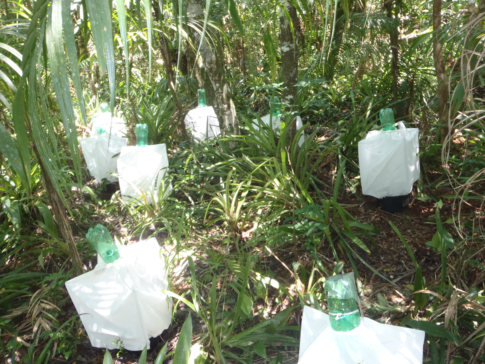

# Predator phylogenetic diversity decreases predation rate via antagonistic interactions

Manuscript: [md](MS/predatordiversity.md), [pdf](MS/predatordiversity.pdf)
Supplementary material : [md](MS/SuppMatt.md), [pdf](MS/SuppMatt.pdf)

## About this project

When predator species occur in the same place, what happens? A single predator species can have important impacts on the prey species in a community. But, when two or more predators are present, those effects become more uncertain. This is because the predators can interact with each other -- either directly, by eating each other, or indirectly, by modifying prey behaviour. Is there any way to predict what will happen?

One possibility comes from the field of "phylogenetic community ecology". This approach suggests that the evolutionary relationships among organisms can help predict their effect on a community. 

In our experiment, we looked at pairs of predators inside the leaves of bromeliads, water-carrying plants which grow in southern Brazil. For each predator pair, we measured the distance between each predator. We related that difference to three kind of predator impacts on the community:

* **distribution** -- do these predators live in the same place?
* **diet** -- do these predators eat the same thing?
* **effect on the community** -- do they do the same thing to the bromeliad ecosystem? and when they are together, is the effect more or less than you would expect? 


_Each one of these small enclosures contains a bromeliad. The bromeliads were stocked with the same starting insect community, then were given one of three different predator treatments._

## Reproducing this manuscript.

This repository contains all the data, code, and text for this manuscript. The manuscript is created by a reproducible workflow using `remake`, created by [Rich Fitzjohn](https://github.com/richfitz). Learn more about how to use it yourself [here](https://github.com/richfitz/remake)

### First, install devtools
```r
## install devtools, if you don't have it
# install.packages("devtools")
devtools::install_github("richfitz/remake")
```

### Package dependencies
This project uses lots of other R packages to organize the data and perform analyses. Install them like this: 

```r
remake::install_missing_packages()
```

### Creating the project

The last step is to create the final project. To do that, run

```r
remake::make()
```

This will run all the models and simulations, build figures, and compile the final pdf output of the main manuscript and the supplementary figures.


## Licenses

The original data, analysis techniques and writing in these documents are copyright &copy; MacDonald, Srivastava and Romero, 2013.

We licence all original text in this repository under CC-BY:
<a rel="license" href="http://creativecommons.org/licenses/by/2.5/ca/deed.en_GB"></a><br /><span xmlns:dct="http://purl.org/dc/terms/" property="dct:title">Predator Phylogenetic Diversity</span> by <span xmlns:cc="http://creativecommons.org/ns#" property="cc:attributionName">A. Andrew M. MacDonald, D.S. Srivastava and G.Q. Romero</span> is licensed under a <a rel="license" href="http://creativecommons.org/licenses/by/2.5/ca/deed.en_GB">Creative Commons Attribution 2.5 Canada License</a>.

_We release Data (contents of [`data`](data/)) are under CC-0_ (we need to talk about this)

We release all dode (all other files, including `.R` scripts in [`R.scripts`](R.scripts/)) under the MIT [license](LICENSE)
